## A — STORYBOARD AND SKETCH

A poster in a public space, scanned with a phone, opening into AR — physical to
psychological, body to mind. The sketches hunt the point where a line has stopped being a
diagram and is not yet an illustration.

<!-- auto:images -->

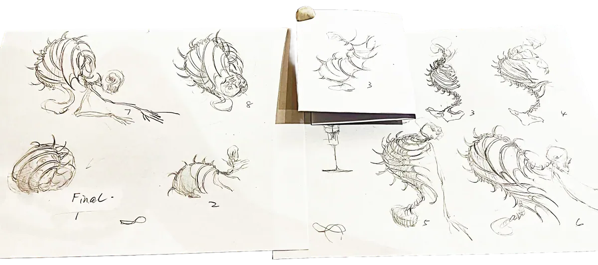

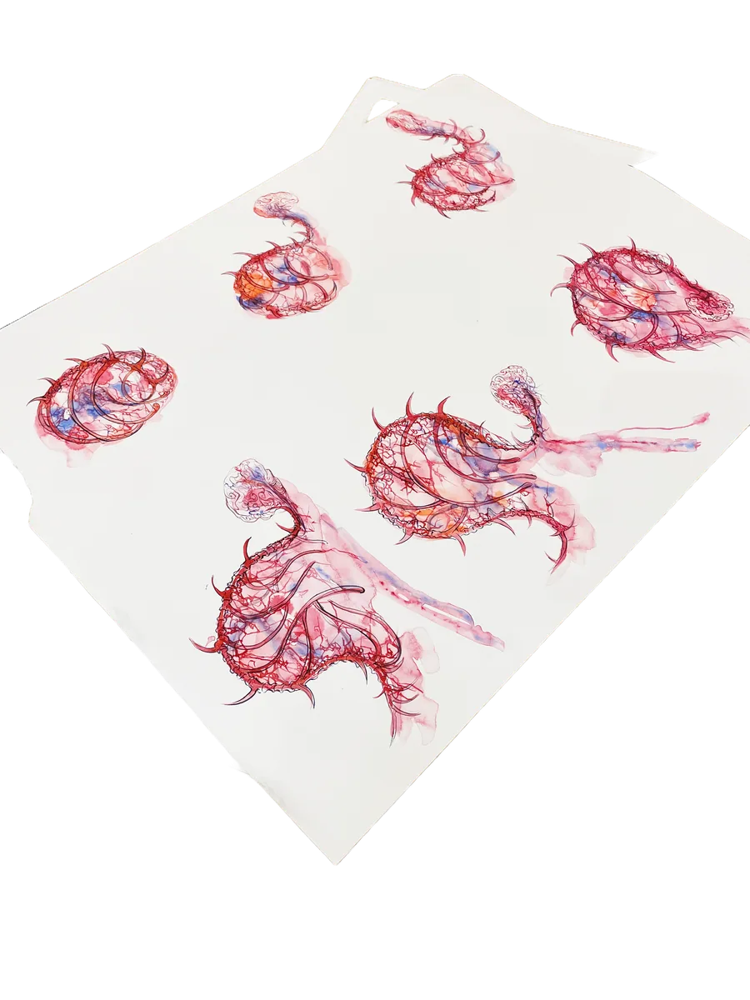

<!-- /auto:images -->

## B — MORPHOLOGICAL DEVELOPMENT: FROM 2D SKETCH TO 3D FORM

Time went into learning Unity AR, not modelling — so I drew by hand and converted with
Tripo AI. The drawing keeps its expression; the conversion tests forms in 3D fast. Of dozens
of generated models I kept a few.

<!-- auto:images -->

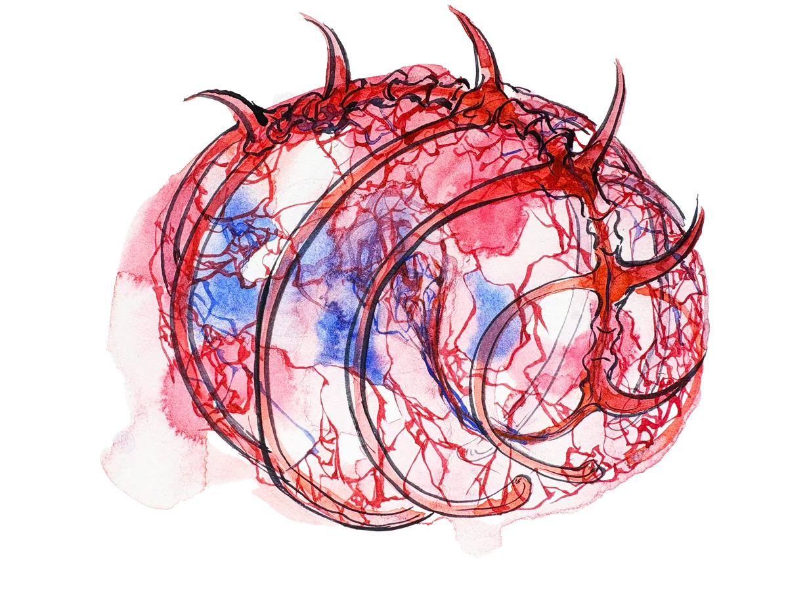

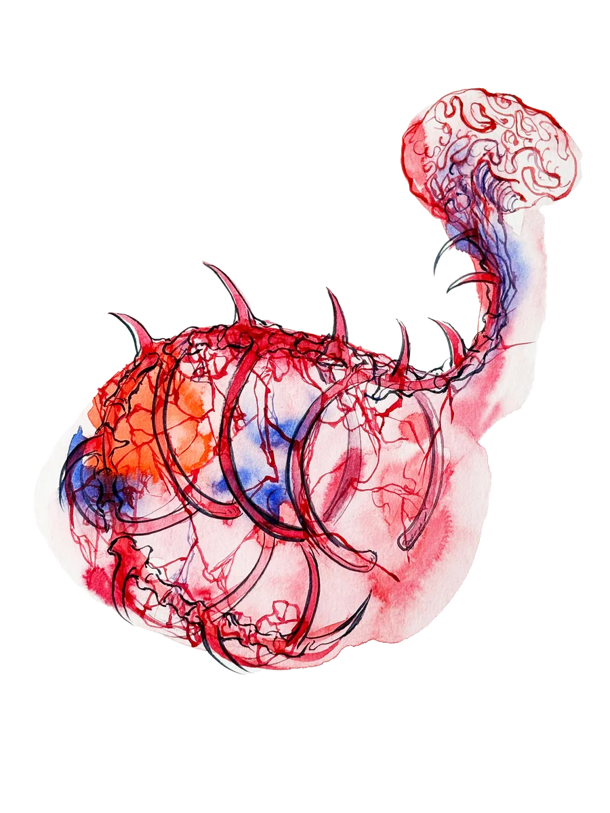

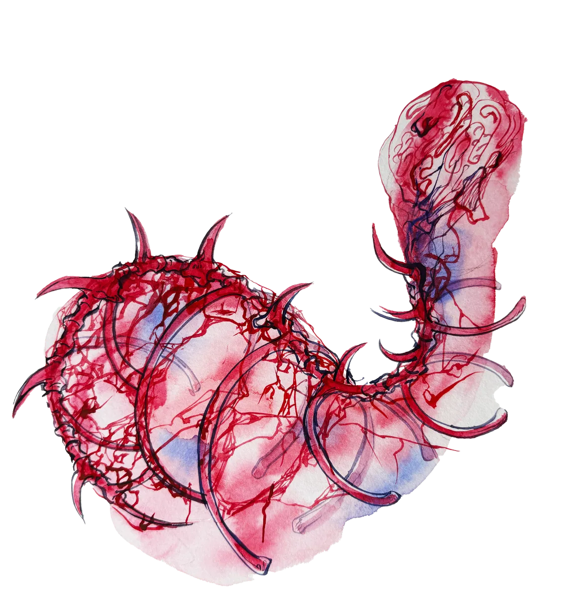

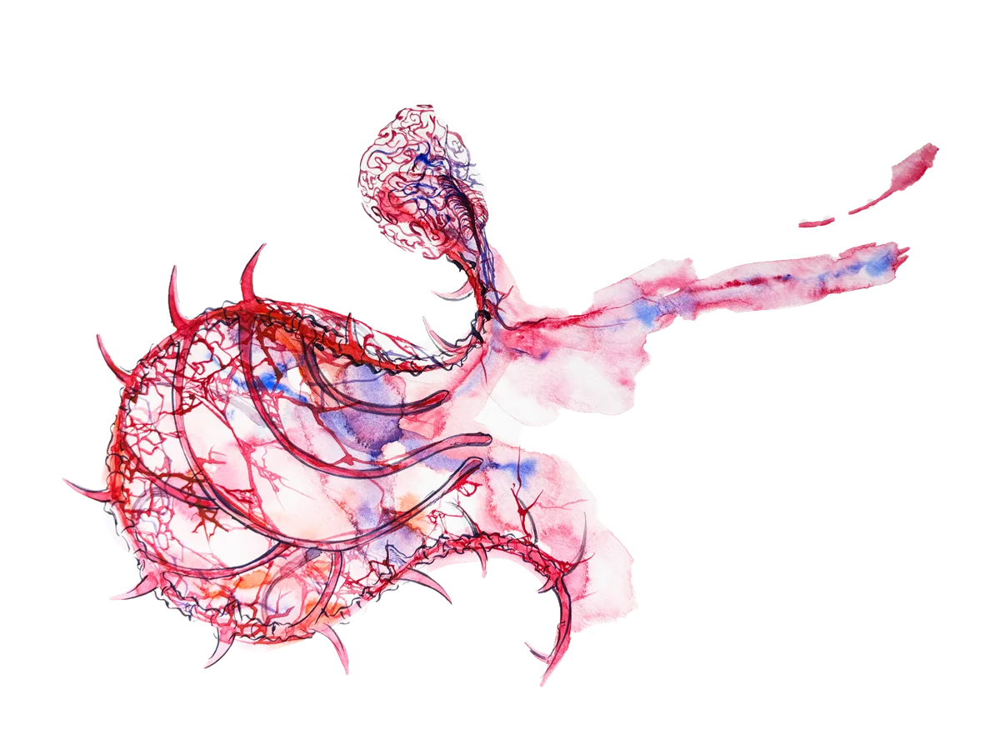

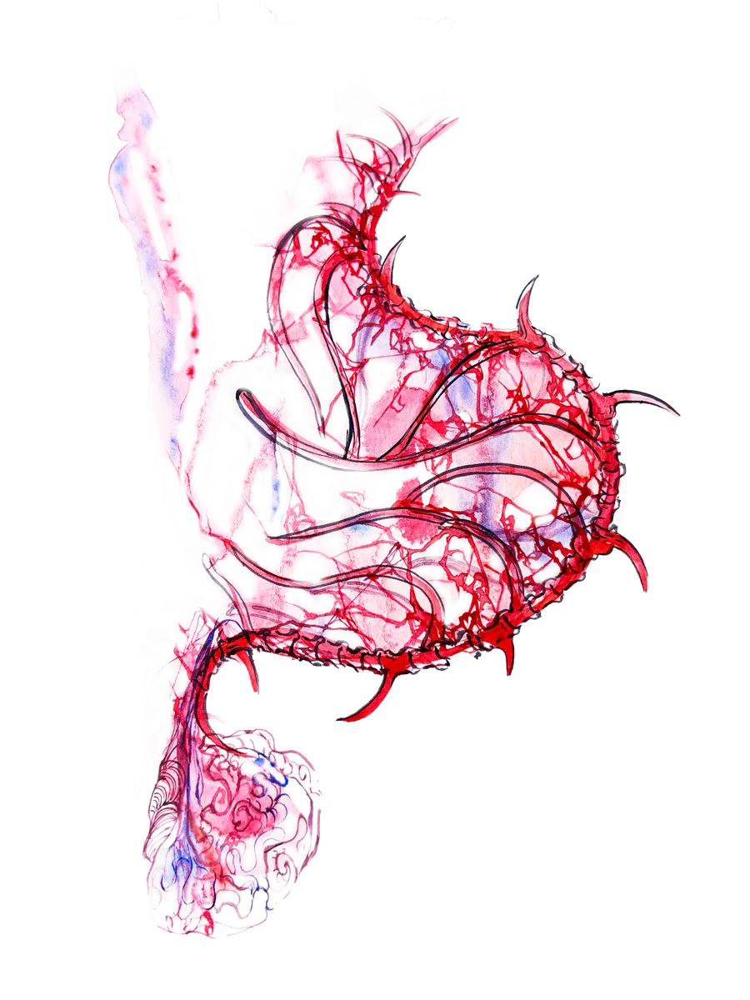

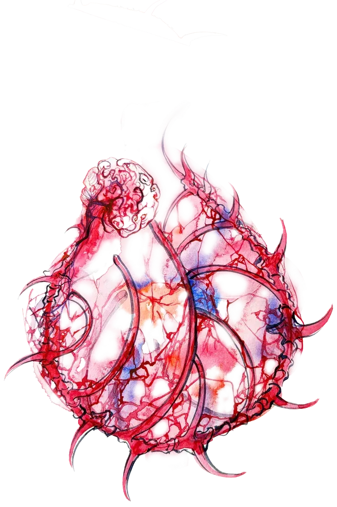

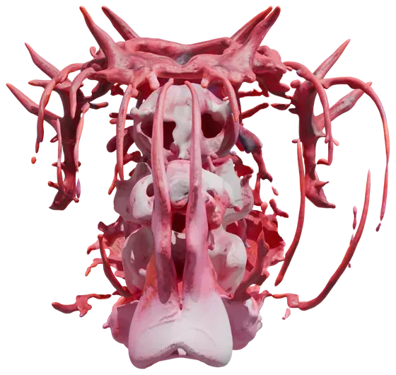

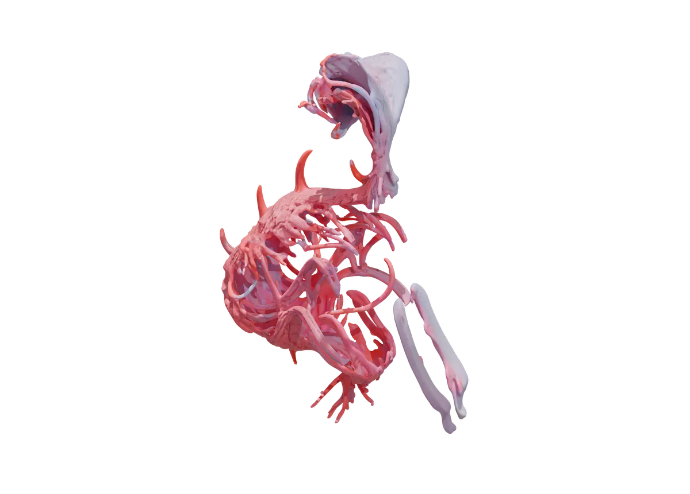

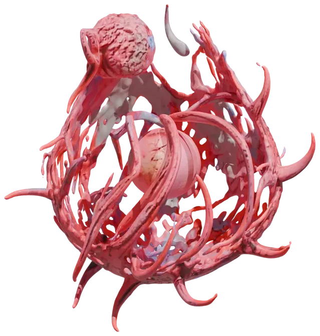

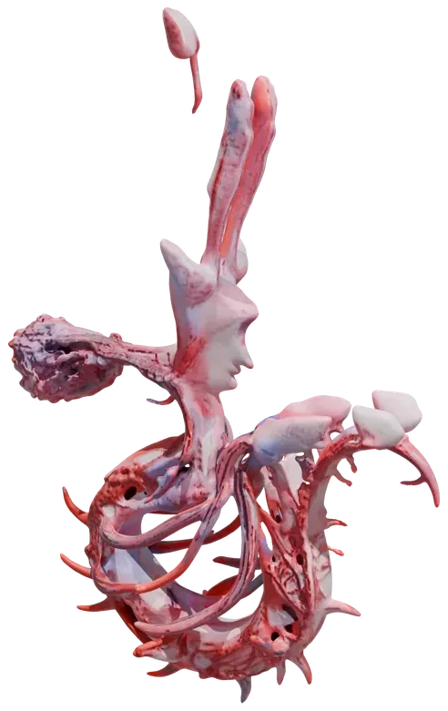

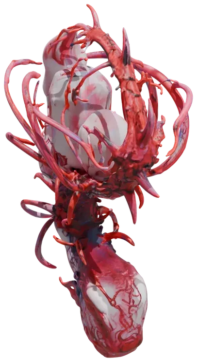

<!-- /auto:images -->

## C — POSTER COMPOSITION

Elements pulled straight from the moodboard and combined with the 3D material. Mostly
graphic design — spatial composition and visual experiment, done fast.

<!-- auto:images -->

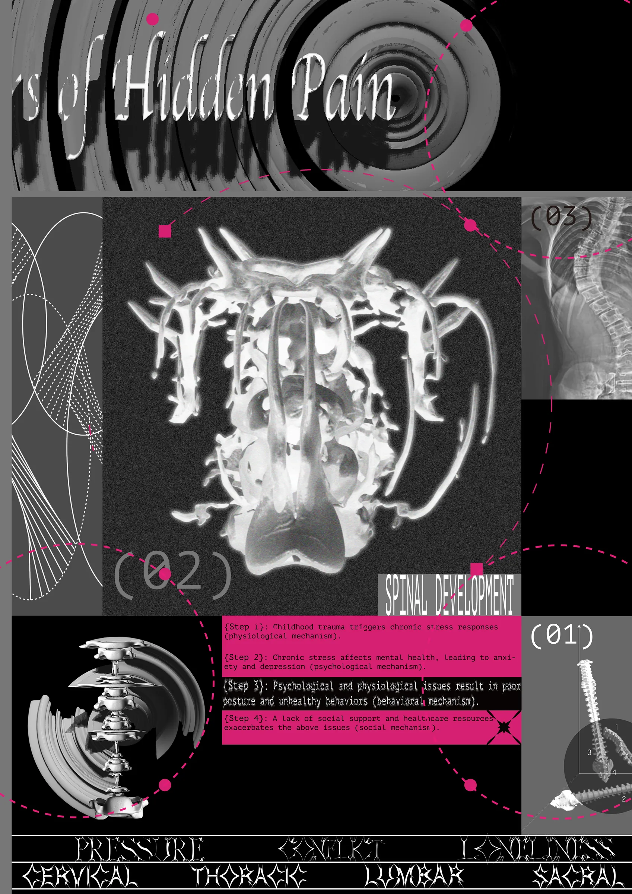

<!-- /auto:images -->

## D — FINAL AR IMPLEMENTATION AND VIDEO PRESENTATION

Audio generated with Suno AI: two tracks layered and distorted into something quiet and
unsettling. Animation and AR built in Unity with Vuforia.

More than half the project time went into learning the software. I'd like to refine this
demo as my technical ability catches up.

<!-- auto:images -->

<video src="/media/contours-hidden-pain/e-final-ar-implementation-and-video-presentation-01.mp4" width="1666" height="1080" controls preload="metadata" aria-label="D — FINAL AR IMPLEMENTATION AND VIDEO PRESENTATION 01"></video>

<!-- /auto:images -->

<!-- 参考文献收在最末尾，不再单开一节。
     三条链接撑不起一张 SHEET —— 原来的 A 节一张图没有，254px 高，
     全是这个列表，而它们的结论页面顶上的 summary 已经说过了。

     注意：章节字母因此整体前移（原 B–E 变成 A–D），而
     ~/Desktop/作品集图片/05 Contours of Hidden Pain/ 里的文件夹还叫 B–E。
     import-images.py 按完整标题（含字母）匹配，所以这个项目现在导入不进新图 ——
     要加图先把 staging 文件夹一起改名。护栏在，匹配不到只是什么都不做，不会删图。 -->

### References

- [Long-term Consequences of Childhood Trauma](https://pubmed.ncbi.nlm.nih.gov/8118090/) — PubMed
- [Childhood Trauma and Physiological Responses](https://pmc.ncbi.nlm.nih.gov/articles/PMC9138975/) — PubMed Central
- [Childhood Trauma Increases Risk of Chronic Pain in Adulthood](https://www.mcgill.ca/newsroom/channels/news/childhood-trauma-increases-risk-chronic-pain-adulthood-353822) — McGill Newsroom

