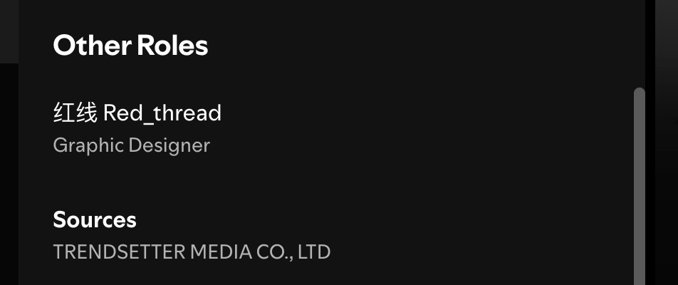
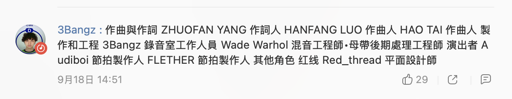
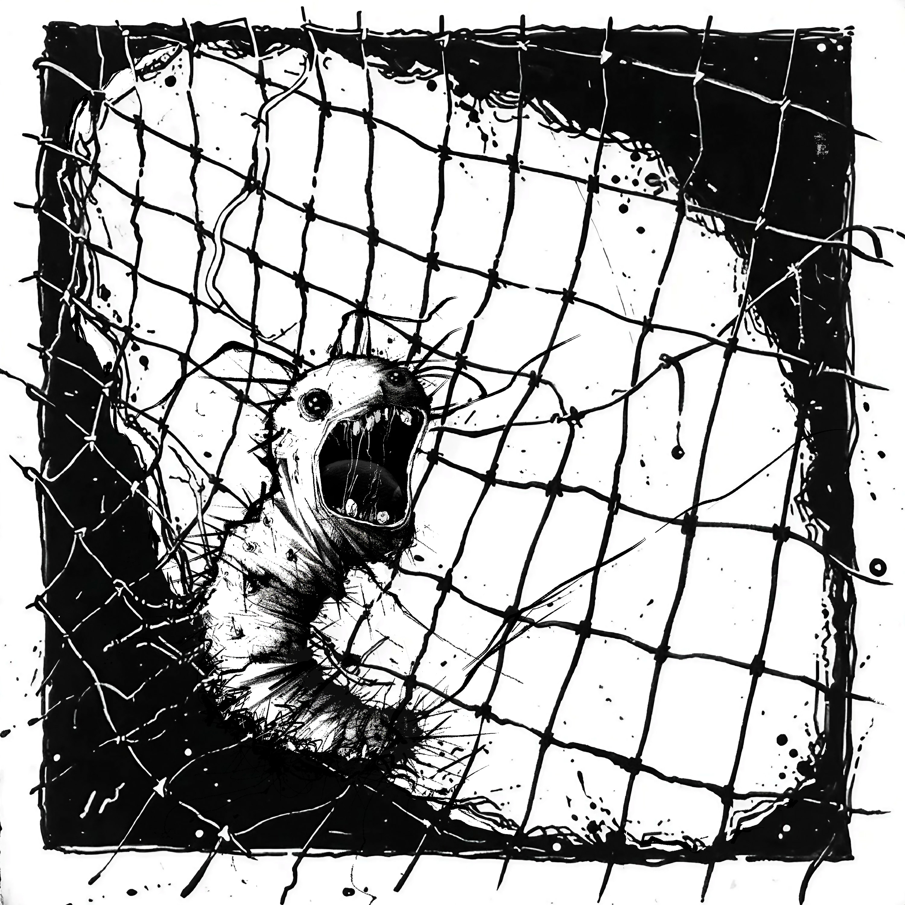
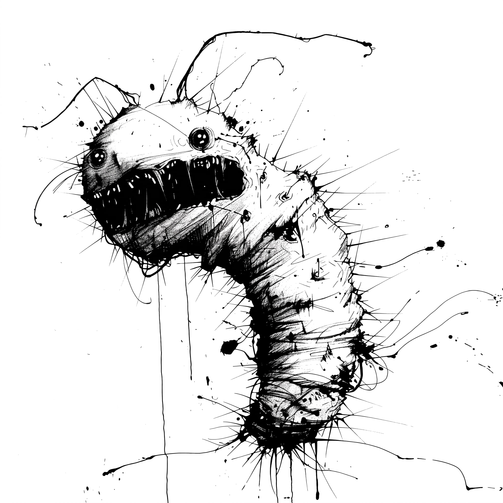
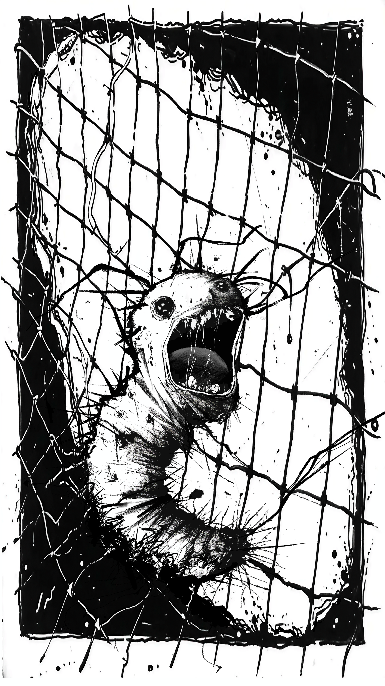

## A — ON SPOTIFY

A screen recording of the release, and the official player. Both the same width,
both the same dark — so the section reads as one thing and not as a pile of
screenshots.

<!-- 两样都是「作品在平台上的样子」：都满宽、都是深色，
     堆在一起节奏是连续的。之前把署名证据混在这里，
     宽窄和明暗一行一跳，整节就散了。 -->
<!-- auto:skip -->

<video src="/media/i-am-a-maggot/on-spotify.mp4" width="1920" height="1096" muted loop playsinline preload="metadata" data-autoplay aria-label="The Canvas playing in the Spotify desktop app"></video>

<iframe src="https://open.spotify.com/embed/album/2lGOcKW1DanxRiDGLVpJmG" width="100%" height="352" frameborder="0" loading="lazy" allow="encrypted-media" title="Spotify — 我是一只蛆"></iframe>

<iframe src="https://music.163.com/outchain/player?type=2&amp;id=3435897553&amp;auto=0&amp;height=66" width="100%" height="86" frameborder="0" loading="lazy" title="NetEase Cloud Music — 我是一只蛆"></iframe>

## B — CREDITED

Two sources, two kinds. Spotify lists it as platform metadata; 3Bangz read the
credit roll out himself in a comment, and signed off on the last line.

<!-- 两张都收到同一个 620px 宽、居中，竖着排成一列。
     并排怎么摆都失衡（一竖一横），同宽叠起来才读成「一组证据」。

     Credits 那张从 952×1076 裁成 952×400：原图上半截是 Performers
     （Audiboi、FLETXHER，都是节拍制作人），和 Ruojing 无关，
     却占掉三百多像素的死重。裁完每一行都是她的。 -->
<!-- auto:skip -->

## C — THE COVER

A maggot screaming behind a net, for a track called *I Am a Maggot*. The net is
the whole argument: without it the drawing is a creature, with it the creature
is caught.

<!-- auto:skip -->

## D — BEFORE THE NET

The first version had no cage. It is arguably the better drawing — the splatter
and the radiating hairs all read — but it is a portrait of a maggot, and the
track is about being stuck. The net went on top and most of the drawing went
under it.

<!-- auto:skip -->

## E — CANVAS

Spotify plays a silent vertical loop behind the track. The square composition
does not survive the crop, so the net was rebuilt for 9:16 — same creature,
rewoven cage.

<!-- auto:skip -->

<video src="/media/i-am-a-maggot/canvas.mp4" width="1080" height="1920" muted loop playsinline preload="metadata" data-autoplay aria-label="Spotify Canvas — six seconds, looping"></video>

