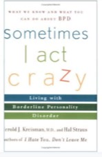

## A — INSPIRATION AND RESEARCH

A book for people with borderline personality disorder. In China it often goes undiagnosed
— I made this to say something myself, and so you know you are not the only one.

Unstable relationships, a distorted sense of self, feelings that never come back down.
Someone described it as *moving through the world without skin*.

### Reference literature

- *Get Me Out of Here*
- *Sometimes I Act Crazy*
- *Understanding the Borderline Mother*
- *The Buddha and the Borderline*

### On-screen

- Winona Ryder as Suzanne in *Girl, Interrupted*
- Matsuko in *Memories of Matsuko*
- Clementine in *Eternal Sunshine of the Spotless Mind*

<!-- auto:skip 手排版面，导入脚本不要动这里 -->

<!-- 参考的书和电影做成一排小窗。三扇片子的窗大、四个书封的窗小，
     高低错开。每扇窗底下那行出处直接取图的 alt，不用另写。

     要放片段就把对应那一行换成 video，别的都不用动，例如：
       <video src="/media/love-borderline/girl-interrupted.mp4"
              aria-label="Girl, Interrupted (1999) dir. James Mangold"></video>
     脚本会自动加上静音、循环、自动播放，样式和静帧的窗一模一样。
     片子文件放 public/media/love-borderline/ 下面。 -->

## B — MOODBOARD

MY MOST OF FILES MISSING .....

<!-- auto:images -->

<!-- /auto:images -->

## C — PHOTOGRAPHY

Taken during lockdown, around my neighbourhood and the old downtown. My friend and I were in
the same quiet, heavy state. On impulse I walked barefoot across a construction site — cold
rising from the ground, roughness, hardness underfoot. A brief, hard connection with
something real.

<!-- auto:images -->

<!-- /auto:images -->

## D — STRUCTURE OF THE BOOK

Three sections, each a different size inside a single A4 frame.

The first is first-person: photographs, drawings and a little text, images linked to each
other so the whole reads as montage. The second is direct — characteristics, causes,
symptoms, co-morbidities. The third is for finding treatment and judging whether it fits.

Saddle-stitched, on vintage special paper, for the archival feel.

<!-- auto:skip 手排版面，导入脚本不要动这里 -->

<!-- data-plot 按图的顺序写「第几行/占第几栏到第几栏+往下沉几rem」。
     01 是三册全摊开的总图，这一节讲的就是它，给到最大；
     03/02 两张封面叠放并排，斜的那张大、竖的那张小且下沉，交叠一栏；
     05/04/06 三张手翻内页，大小不同、高低错开。 -->

## E — PRINT (BOOK DESIGN)

**Part One** follows Rinko Kawauchi, who finds the connection between things that have
nothing to do with each other. Lovers' hands bound in red thread read as parasitic trees —
dependent, and slowly draining one another.

**Part Two** is typographic: free composition and custom type inside a modular grid,
archival in feel, held between structure and spontaneity.

**Part Three** is information design. The emotional narrative turns into a rational system,
and the reader is guided rather than immersed.

<!-- auto:images -->

<!-- /auto:images -->
