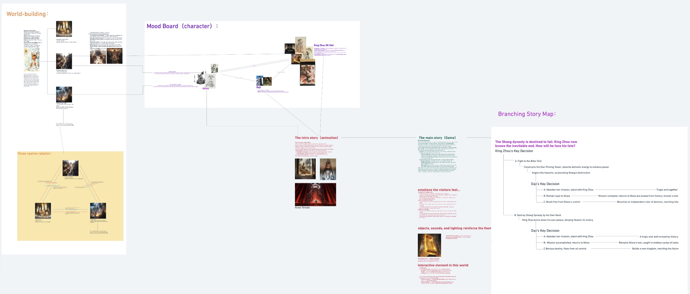

## A — WORLD-BUILDING

Before starting the game design, I focused on organizing and defining the overall narrative
system and world framework of the project. Using the World-building Map, I outlined the
structural relationships and intertwined destinies among gods, humans, and demons. At the
same time, I created a Character Mood Board to visually define each main character's
personality, colour palette, and symbolic meaning.

On the narrative side, I integrated the Intro Animation with the Main Game Story to ensure
a smooth transition between the two mediums. To make the story more traceable and coherent,
I designed a Branching Story Map that clearly marks all key decisions and their outcomes.

The main goal of this stage was to establish a solid foundation for the interactive
storytelling system, ensuring the game world has both internal logic and long-term
scalability.

<!-- auto:images -->

<!-- /auto:images -->

## B — CHARACTER & RELATIONSHIPS

Early exploration stayed deliberately loose — colour blocks, silhouettes and proportion
tests rather than finished designs. Sharp, angular forms read as danger; flowing contours
read as allure and hidden strength.

The story turns on three figures. Nüwa issues the divine command but never strikes
directly. Daji, a nine-tailed fox in human form, is sent into the Shang court to bring
King Zhou down — and begins to waver between obedience and her own will. King Zhou,
blinded by pride, resists both the gods and Daji, and destroys himself through his own
defiance.

<!-- auto:images -->

<!-- /auto:images -->

## C — ESTABLISHING GAME TONE & STORY STYLE

Not just a story-driven card game — a psychological duel between fate and freedom,
divinity and desire. The tone is dark and absurd: the solemnity of epic myth crossed with
a cold reading of faith and human nature, carried by black humour and cruel irony.

<!-- auto:images -->

<video src="/media/nine-lives-game/c-establishing-game-tone-story-style-01.mp4" width="1606" height="1472" muted loop playsinline preload="metadata" data-autoplay aria-label="C — ESTABLISHING GAME TONE & STORY STYLE 01"></video>

<video src="/media/nine-lives-game/c-establishing-game-tone-story-style-02.mp4" width="1606" height="1472" muted loop playsinline preload="metadata" data-autoplay aria-label="C — ESTABLISHING GAME TONE & STORY STYLE 02"></video>

<!-- /auto:images -->

## D — GAME CORE LOOP

**Draw a Card → Make a Decision → Change Stats.**

Every card is a moral event. Each choice shifts four attributes — Love, Corruption,
Divine Favour, Freedom — which decide the branches and endings you reach. Mini-games sit
at key decision points to raise the emotional stakes.

<!-- auto:images -->

<video src="/media/nine-lives-game/d-game-core-loop-01.mp4" width="2628" height="1788" muted loop playsinline preload="metadata" data-autoplay aria-label="D — GAME CORE LOOP 01"></video>

<!-- /auto:images -->

## E — FIRST PROTOTYPE

In less than two weeks, I completed a quick playable prototype to test the feasibility of
the narrative flow and interaction system.

Although the demo had a fairly complete structure — allowing players to experience dialogue
choices, branching paths, and the core gameplay loop — user feedback showed only moderate
engagement. Players understood the concept but lacked emotional investment in the story.

Through this test, I realised that the core loop lacked strong appeal and rewarding
feedback, and that future iterations should focus on making the interaction more dynamic
and immersive.

<!-- auto:images -->

<video src="/media/nine-lives-game/e-first-prototype-01.mp4" width="2948" height="1902" controls preload="metadata" aria-label="E — FIRST PROTOTYPE 01"></video>

<!-- /auto:images -->

## F — PRODUCTION FLOW

I handled the core loop, card system, storytelling visuals, early character concept, and
user testing.

The storytelling workflow stayed simple: script and rough storyboards → thumbnails to fix
the visual tone → AI for the initial motion → After Effects and TouchDesigner for effects
and refinement → sound and voiceover last. Detailed narrative art takes a lot of time, so
the storytelling here leans abstract and expressive.

<!-- auto:images -->

<video src="/media/nine-lives-game/f-production-flow-01.mp4" width="2230" height="1080" muted loop playsinline preload="metadata" data-autoplay aria-label="F — PRODUCTION FLOW 01"></video>

<video src="/media/nine-lives-game/f-production-flow-02.mp4" width="2230" height="1080" muted loop playsinline preload="metadata" data-autoplay aria-label="F — PRODUCTION FLOW 02"></video>

<!-- /auto:images -->

## G — CARD DESIGN

Three card types are planned — Fate, Element and Artifact. Fate and Artifact are still
conceptual; **Element Cards** are the only fully implemented system, and they carry the
core of combat.

In Taoist philosophy each of the Five Elements has a Yin and a Yang form, so every element
here has two personalities, drawn as simple totem-like symbols. Yang Earth is an
unbreakable wall, Yin Earth is moist soil that nurtures life. Yang Metal is a rough battle
axe; Yin Metal a precise ornamental hairpin. Yang Fire explodes; Yin Fire glows quietly
like a ritual flame.

The visuals stay lightweight — easy to read, easy to tell apart, and efficient to produce
at this stage.

<!-- auto:images -->

<video src="/media/nine-lives-game/g-card-design-12.mp4" width="800" height="1066" muted loop playsinline preload="metadata" data-autoplay aria-label="G — CARD DESIGN 12"></video>

<!-- /auto:images -->

## H — GAME ASSETS

### H.1 — NARRATIVE SEQUENCES

<!-- auto:images -->

<video src="/media/nine-lives-game/h-1-narrative-sequences-01.mp4" width="1248" height="704" muted loop playsinline preload="metadata" data-autoplay aria-label="H.1 — NARRATIVE SEQUENCES 01"></video>

<video src="/media/nine-lives-game/h-1-narrative-sequences-02.mp4" width="1280" height="720" muted loop playsinline preload="metadata" data-autoplay aria-label="H.1 — NARRATIVE SEQUENCES 02"></video>

<video src="/media/nine-lives-game/h-1-narrative-sequences-03.mp4" width="1280" height="720" muted loop playsinline preload="metadata" data-autoplay aria-label="H.1 — NARRATIVE SEQUENCES 03"></video>

<video src="/media/nine-lives-game/h-1-narrative-sequences-04.mp4" width="1280" height="720" muted loop playsinline preload="metadata" data-autoplay aria-label="H.1 — NARRATIVE SEQUENCES 04"></video>

<video src="/media/nine-lives-game/h-1-narrative-sequences-05.mp4" width="1280" height="720" muted loop playsinline preload="metadata" data-autoplay aria-label="H.1 — NARRATIVE SEQUENCES 05"></video>

<video src="/media/nine-lives-game/h-1-narrative-sequences-06.mp4" width="1280" height="720" muted loop playsinline preload="metadata" data-autoplay aria-label="H.1 — NARRATIVE SEQUENCES 06"></video>

<video src="/media/nine-lives-game/h-1-narrative-sequences-07.mp4" width="1280" height="720" muted loop playsinline preload="metadata" data-autoplay aria-label="H.1 — NARRATIVE SEQUENCES 07"></video>

<!-- /auto:images -->

### H.2 — SYMBOLS & ICONS

### H.3 — UI & INTERFACE
