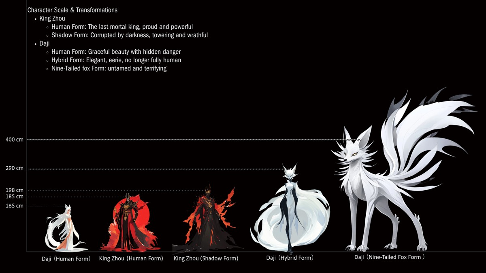
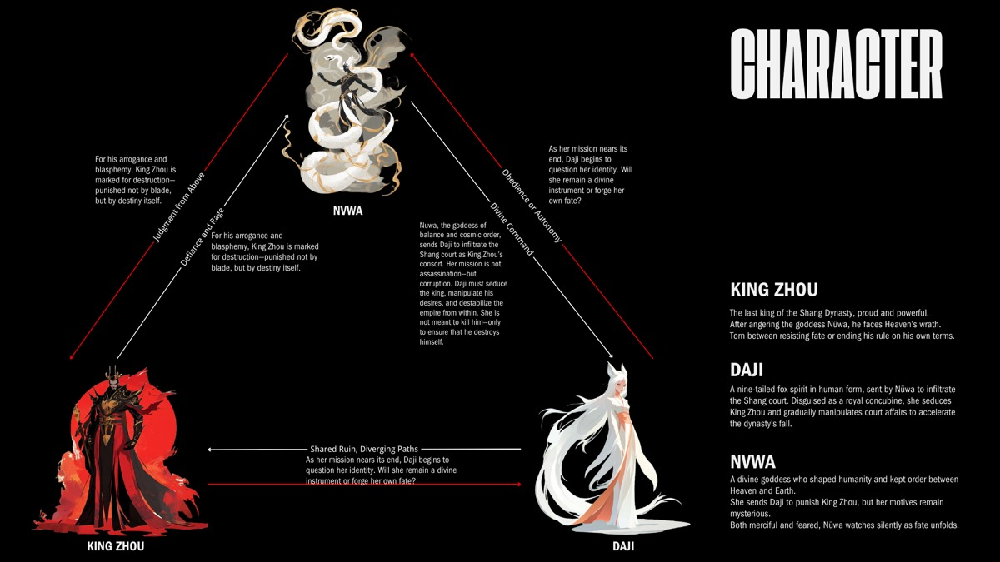
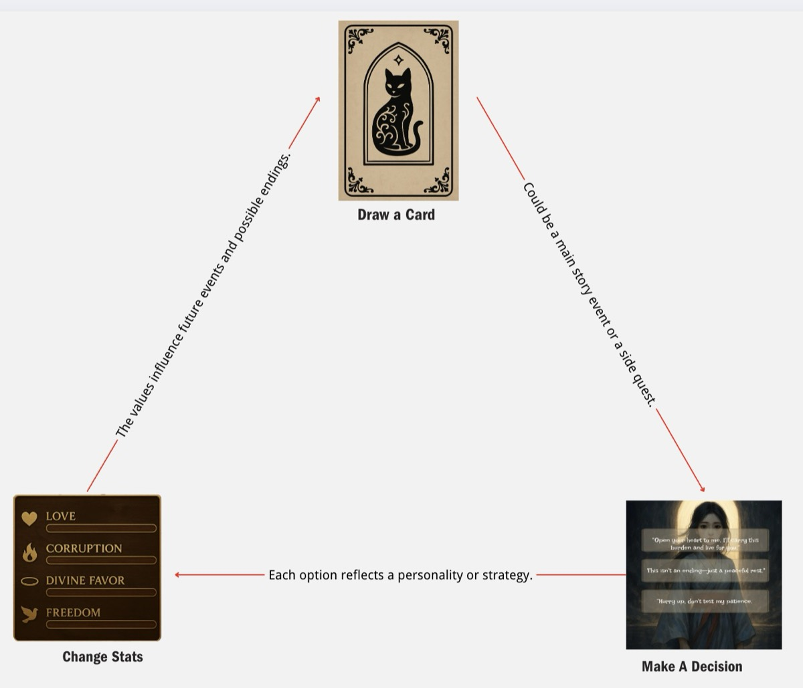
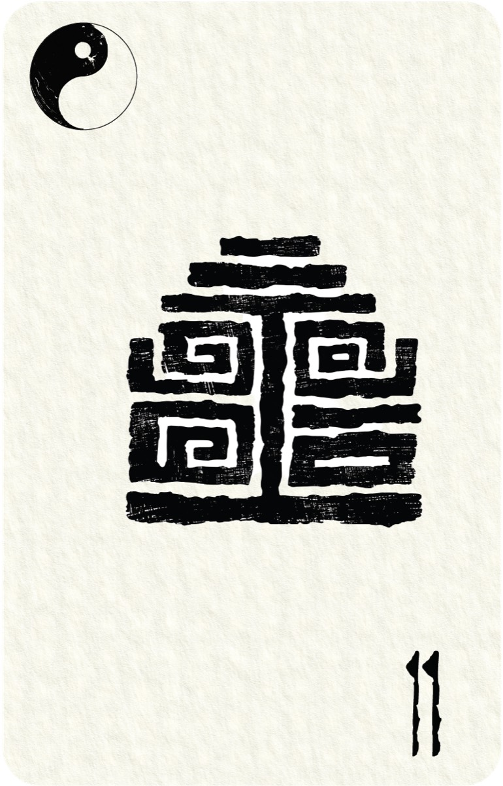
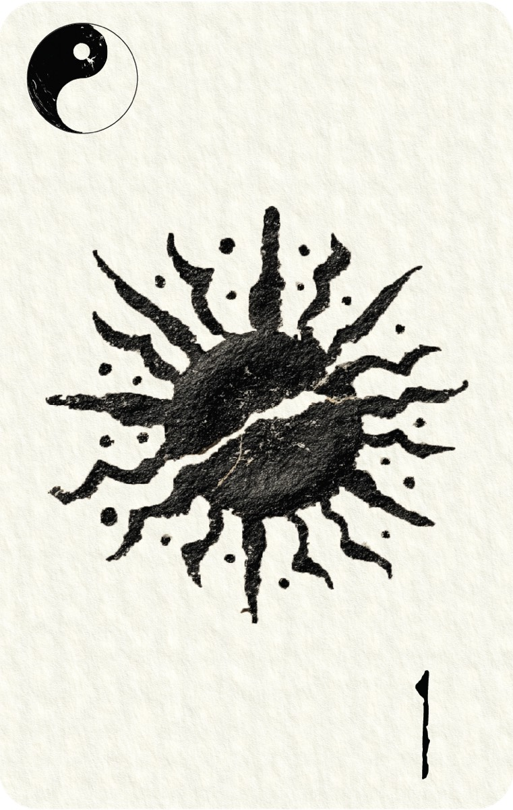
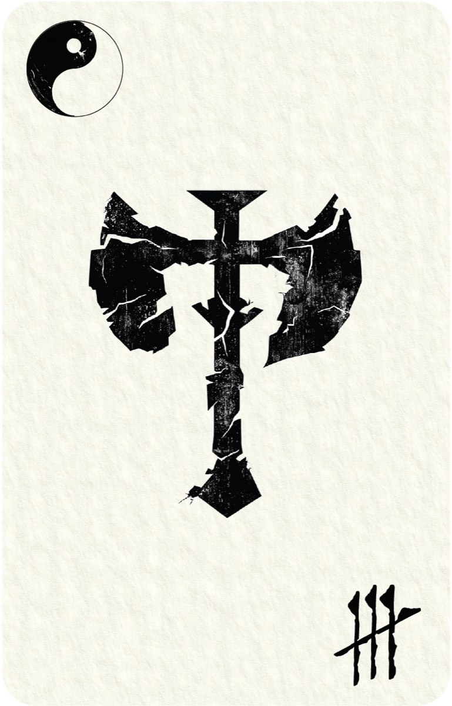
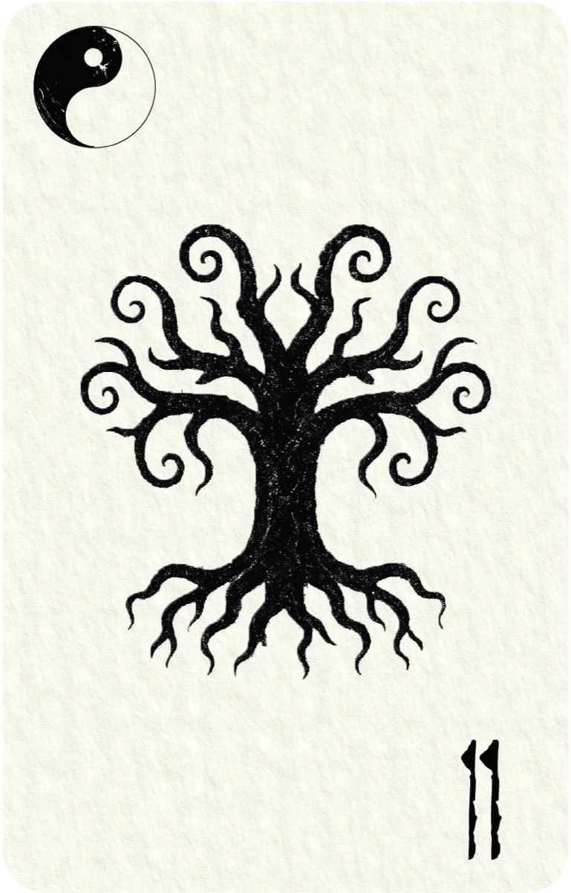
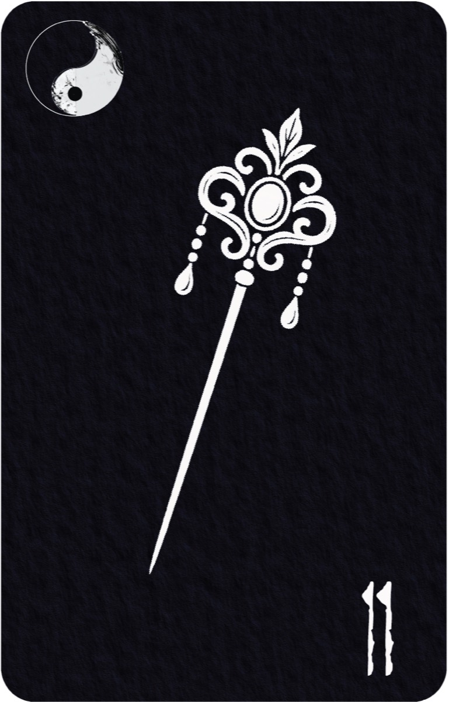
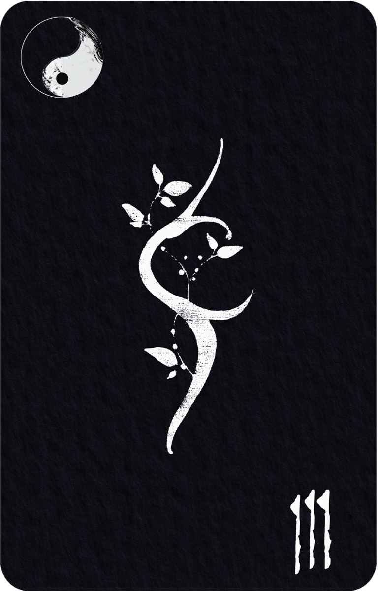
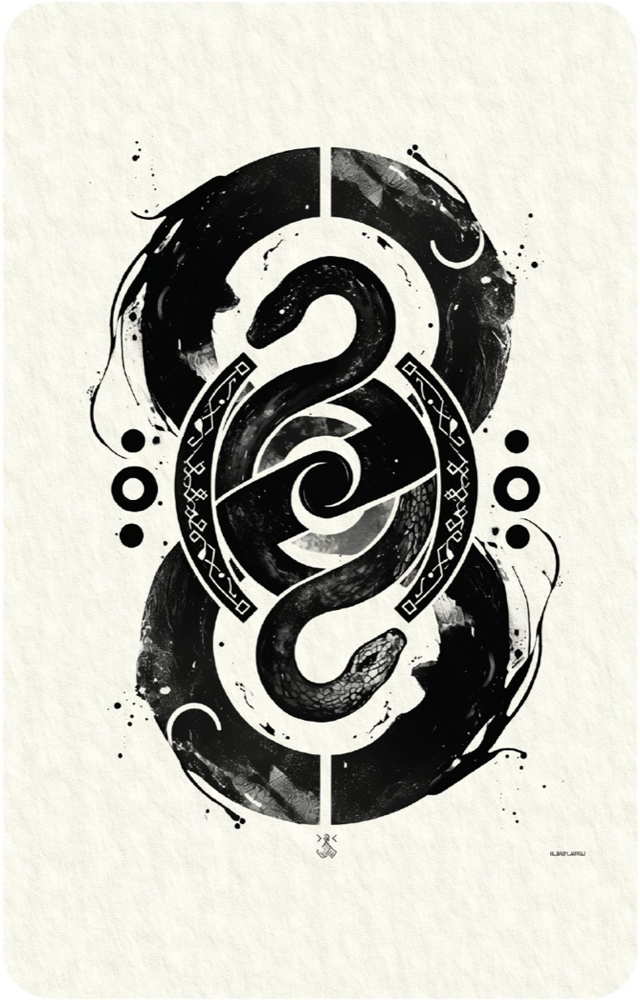

## A — CHARACTER & RELATIONSHIPS

Early exploration stayed loose — colour blocks, silhouettes, proportion tests. Sharp angular
forms read as danger; flowing contours read as allure.

Three figures carry it. Nüwa issues the divine command but never strikes. Daji, a
nine-tailed fox in human form, is sent to bring King Zhou down and begins to waver. King Zhou
resists both the gods and Daji, and destroys himself doing it.

<!-- auto:images -->

<!-- /auto:images -->

## B — GAME CORE LOOP

Each choice shifts four attributes — Love, Corruption, Divine Favour, Freedom — and they
decide which branches and endings you reach.

<!-- auto:images -->

<!-- /auto:images -->

Scene 1: you have to take Su Daji's body. The goal never changes, only what it costs.

Choice

What you do

Stat change

<b>01</b>Force

Tear her soul open and seize the body. Rapid clicks against a soul-pressure bar.

Corruption +2 · Freedom +2 · Divine Favour −2 · Love −1

<b>02</b>Dream

Build her an illusion until she gives the body up willingly. Three rounds of dialogue lower her Mind Resistance.

Divine Favour +2 · Love +1 · Freedom −1 · Corruption ±0

<b>03</b>Poison

Serpent venom in her tea forces the soul out. Sequence clicking — kettle, poison, incense burner.

Corruption +1 · Freedom +2 · Divine Favour −1 · Love −1

## C — FIRST PROTOTYPE

A playable prototype in under two weeks, to test whether the narrative flow and the
interaction held up.

The structure was fairly complete — dialogue choices, branching, the core loop — but testers
were only moderately engaged. They understood the concept and did not care about the story.
The loop lacked appeal and reward; the next iteration has to be more dynamic.

<!-- auto:images -->

<video src="/media/nine-lives-game/hero-01.mp4" width="2948" height="1902" controls preload="metadata" aria-label="C — FIRST PROTOTYPE 01"></video>

<!-- /auto:images -->

## D — PRODUCTION FLOW

I handled the core loop, card system, storytelling visuals, early character concept and user
testing.

The workflow stayed simple: script and rough boards → thumbnails to fix the tone → AI for
initial motion → After Effects and TouchDesigner → sound last. Detailed narrative art takes
a lot of time, so the storytelling leans abstract.

<!-- auto:images -->

<video src="/media/nine-lives-game/f-production-flow-01.mp4" width="2230" height="1080" muted loop playsinline preload="metadata" data-autoplay aria-label="D — PRODUCTION FLOW 01"></video>

<video src="/media/nine-lives-game/f-production-flow-02.mp4" width="2230" height="1080" muted loop playsinline preload="metadata" data-autoplay aria-label="D — PRODUCTION FLOW 02"></video>

<!-- /auto:images -->

## E — CARD DESIGN

Five Elements, each with a Yin and a Yang form — ten cards, ten totems. Yang Earth is an
unbreakable wall; Yin Earth is soil that feeds.

Fate and Artifact cards are planned. Only **Element Cards** are built, and they carry combat.

<!-- auto:images -->

<video src="/media/nine-lives-game/g-card-design-12.mp4" width="800" height="1066" muted loop playsinline preload="metadata" data-autoplay aria-label="E — CARD DESIGN 12"></video>

<!-- /auto:images -->

## F — GAME ASSETS

### F.1 — NARRATIVE SEQUENCES

<!-- auto:images -->

<video src="/media/nine-lives-game/h-1-narrative-sequences-01.mp4" width="1248" height="704" muted loop playsinline preload="metadata" data-autoplay aria-label="F.1 — NARRATIVE SEQUENCES 01"></video>

<video src="/media/nine-lives-game/h-1-narrative-sequences-02.mp4" width="1280" height="720" muted loop playsinline preload="metadata" data-autoplay aria-label="F.1 — NARRATIVE SEQUENCES 02"></video>

<video src="/media/nine-lives-game/h-1-narrative-sequences-03.mp4" width="1280" height="720" muted loop playsinline preload="metadata" data-autoplay aria-label="F.1 — NARRATIVE SEQUENCES 03"></video>

<video src="/media/nine-lives-game/h-1-narrative-sequences-04.mp4" width="1280" height="720" muted loop playsinline preload="metadata" data-autoplay aria-label="F.1 — NARRATIVE SEQUENCES 04"></video>

<video src="/media/nine-lives-game/h-1-narrative-sequences-05.mp4" width="1280" height="720" muted loop playsinline preload="metadata" data-autoplay aria-label="F.1 — NARRATIVE SEQUENCES 05"></video>

<video src="/media/nine-lives-game/h-1-narrative-sequences-06.mp4" width="1280" height="720" muted loop playsinline preload="metadata" data-autoplay aria-label="F.1 — NARRATIVE SEQUENCES 06"></video>

<video src="/media/nine-lives-game/h-1-narrative-sequences-07.mp4" width="1280" height="720" muted loop playsinline preload="metadata" data-autoplay aria-label="F.1 — NARRATIVE SEQUENCES 07"></video>

<!-- /auto:images -->

### F.2 — SYMBOLS & ICONS

### F.3 — UI & INTERFACE
