## A — WORLD & CHARACTERS

Colour blocks, silhouettes, proportion tests. Sharp angular forms read as danger; flowing
contours as allure.

Nüwa issues the command but never strikes. Daji is sent to bring King Zhou down and begins
to waver. Zhou resists them both, and destroys himself doing it.

<!-- auto:images -->

<!-- /auto:images -->

## B — FIRST PROTOTYPE

Four hidden attributes — Love, Corruption, Divine Favour, Freedom — shift with every choice
and decide the ending you reach.

Scene 1: take Su Daji's body. The goal never changes, only what it costs.

Choice

What you do

Stat change

<b>01</b>Force

Tear her soul open and seize the body. Rapid clicks against a soul-pressure bar.

Corruption +2 · Freedom +2 · Divine Favour −2 · Love −1

<b>02</b>Dream

Build her an illusion until she gives the body up willingly. Three rounds of dialogue lower her Mind Resistance.

Divine Favour +2 · Love +1 · Freedom −1 · Corruption ±0

<b>03</b>Poison

Serpent venom in her tea forces the soul out. Sequence clicking — kettle, poison, incense burner.

Corruption +1 · Freedom +2 · Divine Favour −1 · Love −1

Built in **ProtoPie, not Unity** — two weeks, because "does the flow hold up" doesn't need an
engine to answer. Testers said:

> They understood the concept and did not care about the story. The loop lacked appeal and
> reward.

Everything after this section answers those two sentences.

<!-- auto:images -->

<video src="/media/nine-lives-game/hero-01.mp4" width="2948" height="1902" controls preload="metadata" aria-label="B — FIRST PROTOTYPE 02"></video>

<!-- /auto:images -->

Phase I — the ProtoPie prototype that got tested. Not the current build.

<!-- auto:skip 手排版面，导入脚本不要动这里 -->

The loop is the thing the testers were describing. Both versions of it, side by side:

<figure>

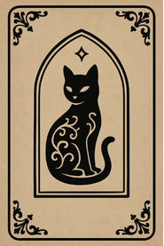

<figcaption>Draw a card</figcaption>

</figure>

a main story event, or a side quest

<figure>

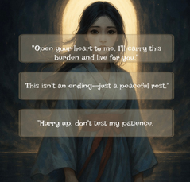

<figcaption>Make a decision</figcaption>

</figure>

each option reflects a personality or a strategy

<figure>

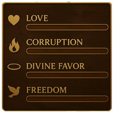

<figcaption>Change stats</figcaption>

</figure>

the four values steer the events and endings you reach

Phase I. Three steps and four numbers — everything the card does happens out of sight.

<figure>

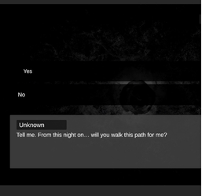

<figcaption>Narrative</figcaption>

</figure>

triggers events and fate hints

<figure>

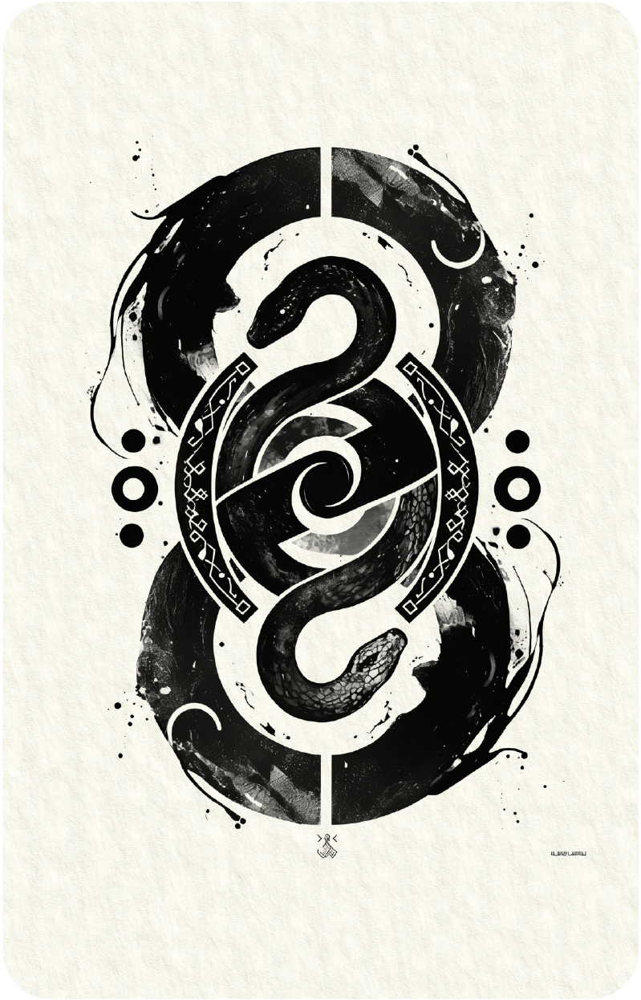

<figcaption>Combat</figcaption>

</figure>

decides outcomes and stat growth

<figure>

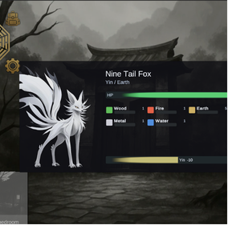

<figcaption>Progression</figcaption>

</figure>

higher stats unlock branching storylines, side quests and fate events

Phase II. The same three beats, but the card is now played — so the loop pays you back where you can see it.

## C — THE TEN STEMS

Not five elements with a yin and yang coat of paint. The **Ten Heavenly Stems** arrive
already doubled: 甲 the upright tree, 乙 the coiling vine; 丙 the sun, 丁 the lamp. Three
words per card, fixed before anything was drawn:

Stem

Three words

What it has to be

<b>甲</b>Yang Wood

upward · straight · growth

Reach and escalation

<b>乙</b>Yin Wood

soft · coiling · poison

Binds and lingers

<b>丙</b>Yang Fire

deflagration · blazing sun · outward

Everything at once, nothing held back

<b>丁</b>Yin Fire

candle flame · ritual · night fire

Small, deliberate, marks a target

<b>戊</b>Yang Earth

mountain · mass · defence

The wall that doesn't move

<b>己</b>Yin Earth

wet soil · mud · healing

The ground that feeds — restoration

<b>庚</b>Yang Metal

unyielding · slaughter · steel

The axe. Straight damage

<b>辛</b>Yin Metal

refined · delicate · small implements

Precision and refinement over force

<b>壬</b>Yang Water

ocean · storm · surging

Overwhelms by volume

<b>癸</b>Yin Water

rain threads · night · cold dew

Seeps in, conceals

Underneath runs the overcoming cycle. In the build it tilts an exchange rather than
deciding it.

## D — PROCESS

Four decisions did most of the work, and none of them were about drawing.

Decision

What it bought

Borrow a system that already has meaning; don't invent one.

Five elements with a yin and yang label is a spreadsheet. The Ten Stems arrive already differentiated, so ten cards felt distinct before a single mark.

Write the words before the image.

Three words per card, fixed first. If two cards can't be separated in words, the paintings won't separate them either — 庚 and 辛 are both metal, but "slaughter, steel" and "delicate, small implements" are not one card.

Make the polarity visible, not labelled.

Yang cards are cream paper with a black glyph; Yin inverts to near-black with white. Readable across a table, without reading the corner.

Prototype in the cheapest tool that can answer the question.

ProtoPie took two weeks and told me the loop was wrong. Finding that out after a Unity build would have cost months.

Pipeline: script and boards → thumbnails → AI for initial motion → After Effects and
TouchDesigner → sound last. The storytelling leans abstract on purpose — at this size,
detailed narrative art is the most expensive thing there is.

<!-- auto:images -->

<video src="/media/nine-lives-game/f-production-flow-01.mp4" width="2230" height="1080" muted loop playsinline preload="metadata" data-autoplay aria-label="D — PROCESS 01"></video>

<video src="/media/nine-lives-game/f-production-flow-02.mp4" width="2230" height="1080" muted loop playsinline preload="metadata" data-autoplay aria-label="D — PROCESS 02"></video>

<!-- /auto:images -->

## E — GAME ASSETS

### E.1 — NARRATIVE SEQUENCES

<!-- auto:skip 手排版面，导入脚本不要动这里 -->

<!-- auto:images -->

<video src="/media/nine-lives-game/h-1-narrative-sequences-01.mp4" width="1248" height="704" muted loop playsinline preload="metadata" data-autoplay aria-label="E.1 — NARRATIVE SEQUENCES 01"></video>

<video src="/media/nine-lives-game/h-1-narrative-sequences-02.mp4" width="1280" height="720" muted loop playsinline preload="metadata" data-autoplay aria-label="E.1 — NARRATIVE SEQUENCES 02"></video>

<video src="/media/nine-lives-game/h-1-narrative-sequences-03.mp4" width="1280" height="720" muted loop playsinline preload="metadata" data-autoplay aria-label="E.1 — NARRATIVE SEQUENCES 03"></video>

<video src="/media/nine-lives-game/h-1-narrative-sequences-04.mp4" width="1280" height="720" muted loop playsinline preload="metadata" data-autoplay aria-label="E.1 — NARRATIVE SEQUENCES 04"></video>

<video src="/media/nine-lives-game/h-1-narrative-sequences-05.mp4" width="1280" height="720" muted loop playsinline preload="metadata" data-autoplay aria-label="E.1 — NARRATIVE SEQUENCES 05"></video>

<video src="/media/nine-lives-game/h-1-narrative-sequences-06.mp4" width="1280" height="720" muted loop playsinline preload="metadata" data-autoplay aria-label="E.1 — NARRATIVE SEQUENCES 06"></video>

<video src="/media/nine-lives-game/h-1-narrative-sequences-07.mp4" width="1280" height="720" muted loop playsinline preload="metadata" data-autoplay aria-label="E.1 — NARRATIVE SEQUENCES 07"></video>

<!-- /auto:images -->

### E.2 — SYMBOLS & ICONS

<!-- auto:skip 手排版面，导入脚本不要动这里 -->

Fate and Artifact cards are planned. Only **Element Cards** are built, and they carry combat.

<!-- auto:images -->

<video src="/media/nine-lives-game/g-card-design-12.mp4" width="800" height="1066" muted loop playsinline preload="metadata" data-autoplay aria-label="E.2 — SYMBOLS & ICONS 12"></video>

<!-- /auto:images -->

### E.3 — UI & INTERFACE

<!-- auto:skip 手排版面，导入脚本不要动这里 -->

Unity's defaults covered the painting they were meant to frame. Rebuilt from the health bar
out: dark ground, art on top, frame around.

<!-- 这八张都是深色底的界面件，所以给它们一条黑带。
     02–06 的四角实测就是 (0,0,0) 纯黑 —— 落在黑带上边界整个消失，
     五块牌像本来就刻在同一片底上；摊在纸上的话就是五个黑方块。
     07–09 是真 alpha，中间那圈透明在黑带里正好补成黑，
     name plate 的空槽、印记里的黑地，都跟游戏里一个样。 -->

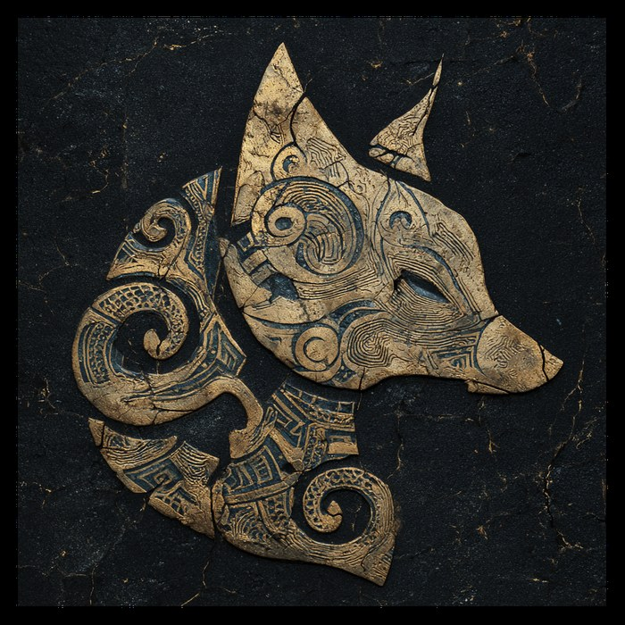

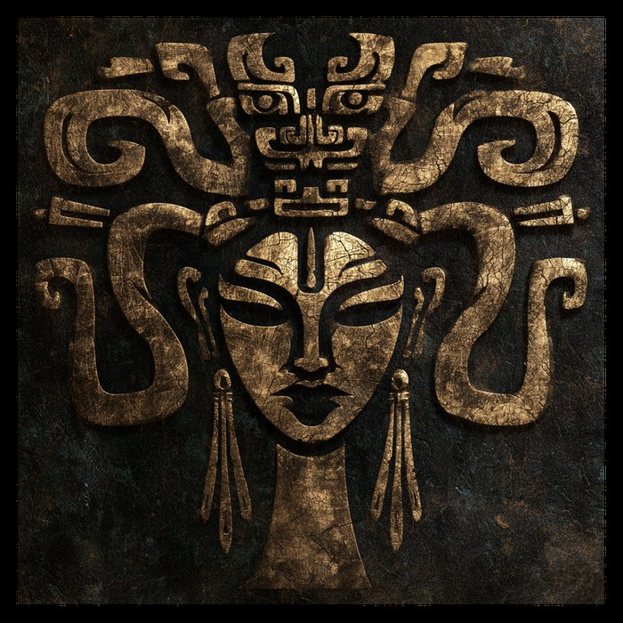

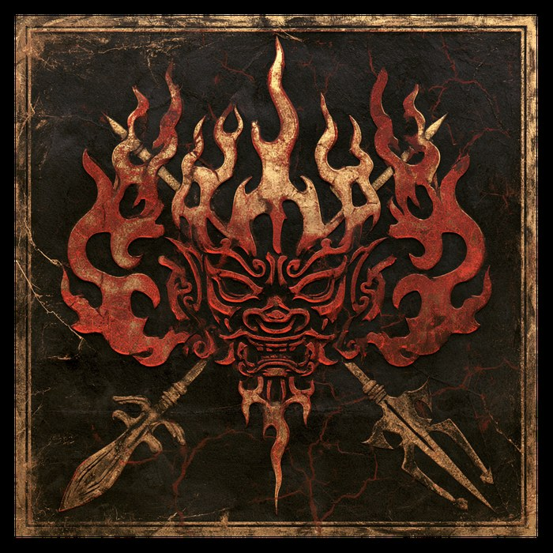

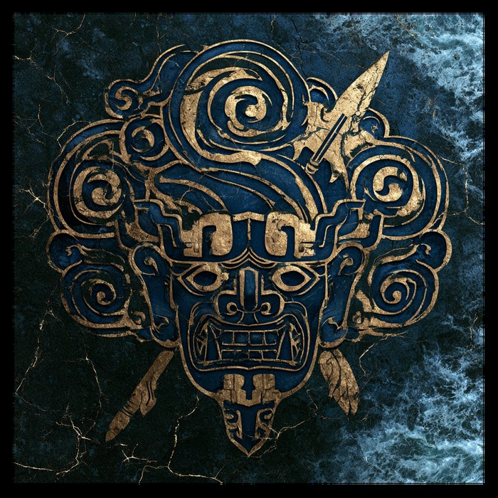

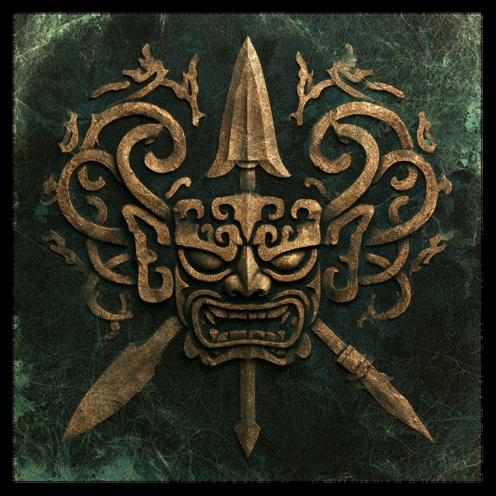

The five who appear in the name plate.

<!-- 血条和那三个零件排成一行，等高、排不下就横滑（.rail）。

     血条那张原本三个档位之间隔的是白画布 —— 白在纸上靠 multiply 能落成
     纸色，可这里是黑带，白就成了三道白杠。所以按空档切开再拼回去，
     档与档之间换成黑：拼完实测 0.00% 亮像素，压在黑带上没有边。

     拼回一张而不是留成三张，是因为要「等高」：血条 5:1、零件 1:1，
     三条血条各自站成一格的话，等高之后每条宽到一千像素，一行里全是它。
     合成一张之后比例 1.57，和 1:1 的零件并排大小相当。 -->

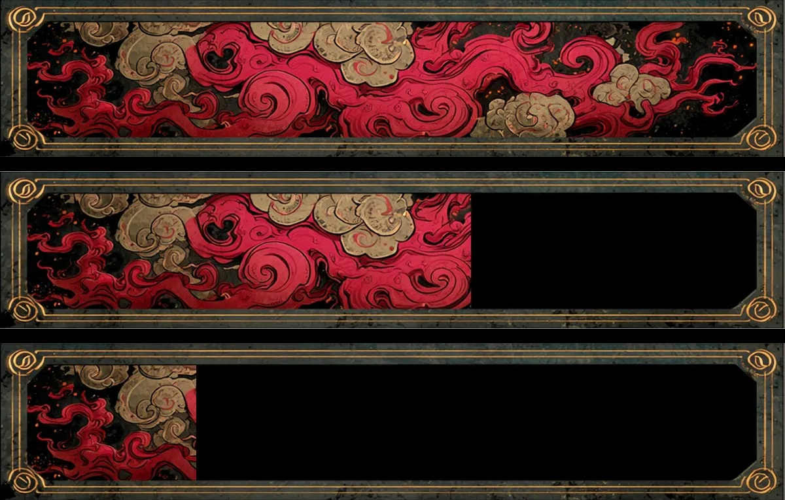

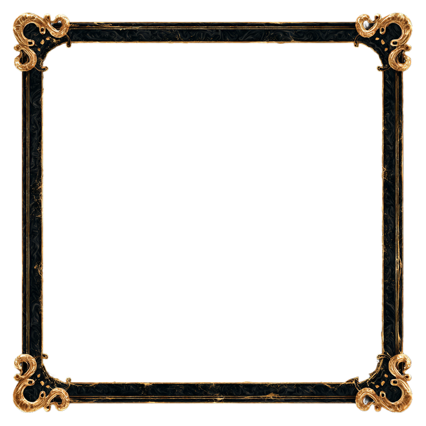

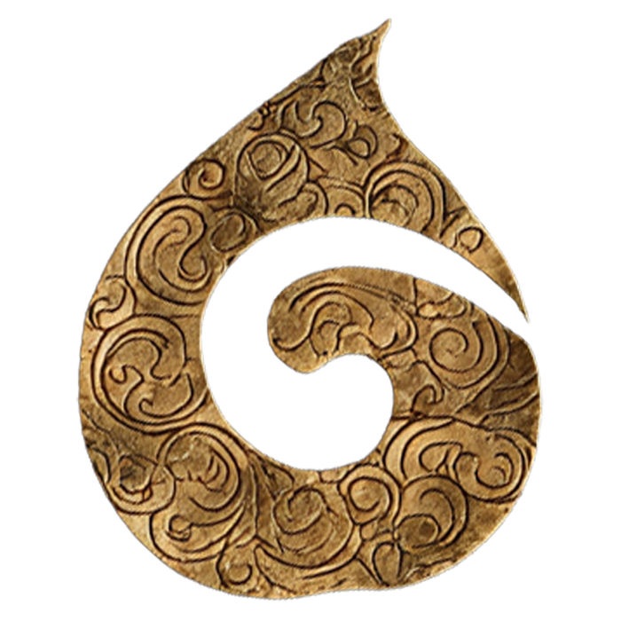

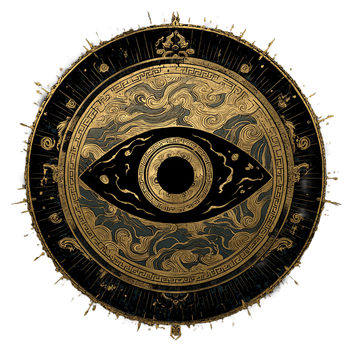

Full, then spent: the fill clips back and the groove shows through. Name plate frame, energy pip, drop seal.

The advantage tell, card costs and five status effects are built and still invisible.

## F — WHERE IT LANDED

Phase II is a team build in Unity. **Engineering is his; the card system, the art and the
script are mine.**

Boot → Title → Town → Battle: a hub gated on story flags, and combat carrying the ten-stem
deck. The two things testers said were missing — somewhere for the story to happen, a loop
that pays you back.

A prototype, not a shipped game. What it settles is that the deck works as mechanics, not
only as illustration.

