<!-- 注意：章节字母重排过（原 B 并进了 A，其后各进一位），
     而 ~/Desktop/作品集图片 里的暂存文件夹仍是 A–F 的旧字母。
     import-images.py 是按「含字母的完整标题」配对的，现在配不上 ——
     这一页别再跑导入，手动加素材。图片文件名里的旧字母前缀不用改，
     md 是按文件名引用的，跟标题字母无关。 -->

## A — INSPIRATION

*Berserk* set this off — resisting a fate already decided. That led to *The War of
Deification*: the fallen are enrolled as gods, from a list written before the war began.

It opens with a proud king insulting the goddess of creation. His kingdom falls.

Storyboards for the rhythm, a script for the tone — no visual style yet, no technical
direction, just looking for a way to tell it. A dynasty falls because of two lines the king
writes on the goddess's wall:

> Within the golden chambers shines a beauty rare, 
> If she were mine, what joy beyond compare.

<!-- auto:images -->
<!-- 两张 moodboard 本来就画在纸上，暗底上既不能叠底也不能反色
     （彩色拼贴，反了就毁）。给它们一条通栏纸带，当成卷宗里
     「这一部分在纸上」那一段。

     三个白要对齐：纸带是 --paper (247,248,247)，两张扫描件原本是
     243,243,243 和 222,220,219 —— 并排就是三种白。已按各自的纸色
     做过白点校正（逐通道增益），现在三者一致，接缝看不出来。 -->

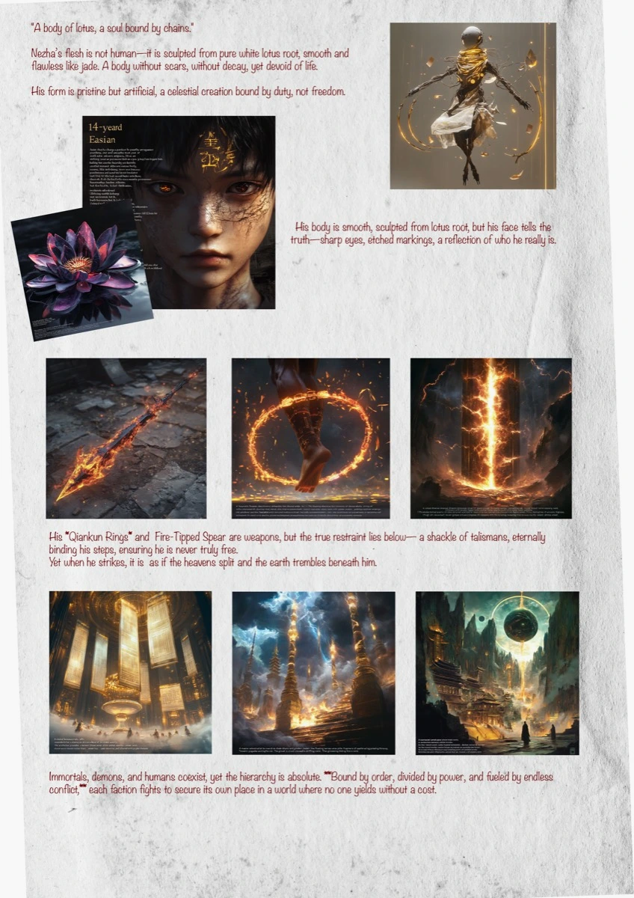

## B — AI PROTOTYPE ITERATION

A test video in Sora AI, to check whether the story logic and the camera language worked. I
was working around what AI video was bad at then — characters that drift, transitions that
make no sense, no emotional register. Rough, but it confirmed the structure held.

<!-- auto:images -->

<video src="/media/nine-lives-intro/c-ai-prototype-iteration-01.mp4" width="2560" height="1440" controls preload="metadata" aria-label="B — AI PROTOTYPE ITERATION 01"></video>

<!-- /auto:images -->

## C — VISUAL STYLE AND TECHNICAL REFINEMENT

*The Secret of Kells*, Dunhuang murals and *Madoka Magica* pushed it to 2D flat animation
with collage composition — surreal, symbolic, fragmented, which gives the myth somewhere to
sit inside a flat space.

Script and scene design were revised to match. Base visuals generated in Midjourney, then
repainted and reconstructed in Photoshop and Procreate, animated in After Effects. Some shots
— the flames turning into a fox — are hand-drawn frame by frame.

<!-- auto:skip 手排版面，导入脚本不要动这里 -->

<!-- 四张都是 1000×500，比例一样，所以 2×2 排正好齐。
     暗底上 cutout 会自动反过来做（反色 + screen，见 .is-dark 那条）：
     白纸落进页面，只剩铅笔线是白的浮在暗底上。 -->

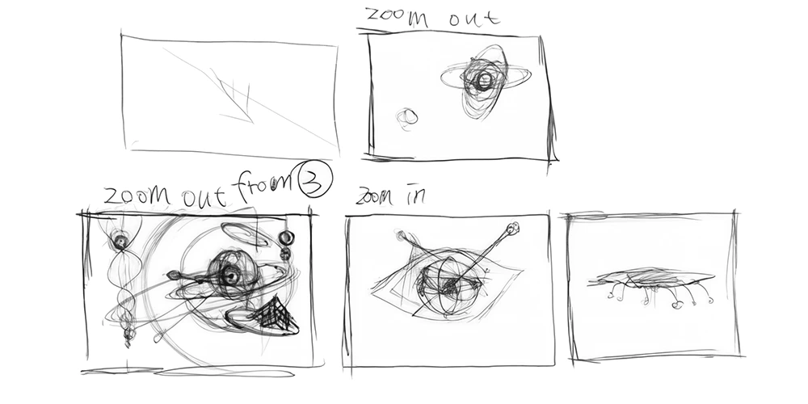

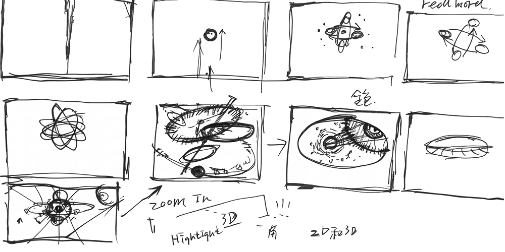

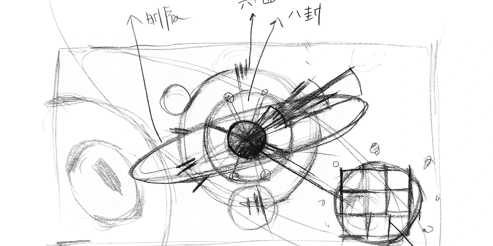

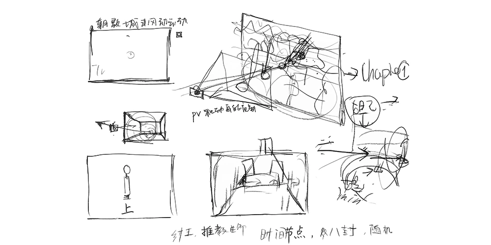

<!-- 狐火和四段工序排成一行，等高，排不下就横滑。
     狐火在最前面、也最宽 —— 它是唯一能当画看的一段；后面四段是
     「这活怎么做出来的」的注脚。
     狐火原片是在访达预览窗口里录的屏（顶上标题栏、底下一排缩略图），
     已经裁掉界面（crop 2180x1268 +92），前十三秒只有一点火星也剪了。 -->

<video src="/media/nine-lives-intro/c-foxfire.mp4" width="1400" height="814" muted loop playsinline preload="metadata" data-autoplay aria-label="Flames turning into a fox"></video>

<video src="/media/nine-lives-intro/c-process-01.mp4" width="1280" height="930" muted loop playsinline preload="metadata" data-autoplay aria-label="Midjourney — base visuals"></video>

<video src="/media/nine-lives-intro/c-process-02.mp4" width="990" height="720" muted loop playsinline preload="metadata" data-autoplay aria-label="Photoshop — repainting"></video>

<video src="/media/nine-lives-intro/c-process-03.mp4" width="990" height="720" muted loop playsinline preload="metadata" data-autoplay aria-label="After Effects — the seal"></video>

<video src="/media/nine-lives-intro/c-process-04.mp4" width="990" height="720" muted loop playsinline preload="metadata" data-autoplay aria-label="After Effects — 3D camera"></video>

Flames turning into a fox, hand-drawn frame by frame — then Midjourney → Photoshop → After Effects.

## D — FILM STILLS

The opening holds still — stable composition, symbolic figures. After the king's poem it
goes abstract: Nüwa's anger as flat geometry, cosmic order coming apart. The last thirty
seconds turn realistic, with pseudo-3D depth built in After Effects.

The final explosion takes the shape of a fox.

<!-- auto:images -->

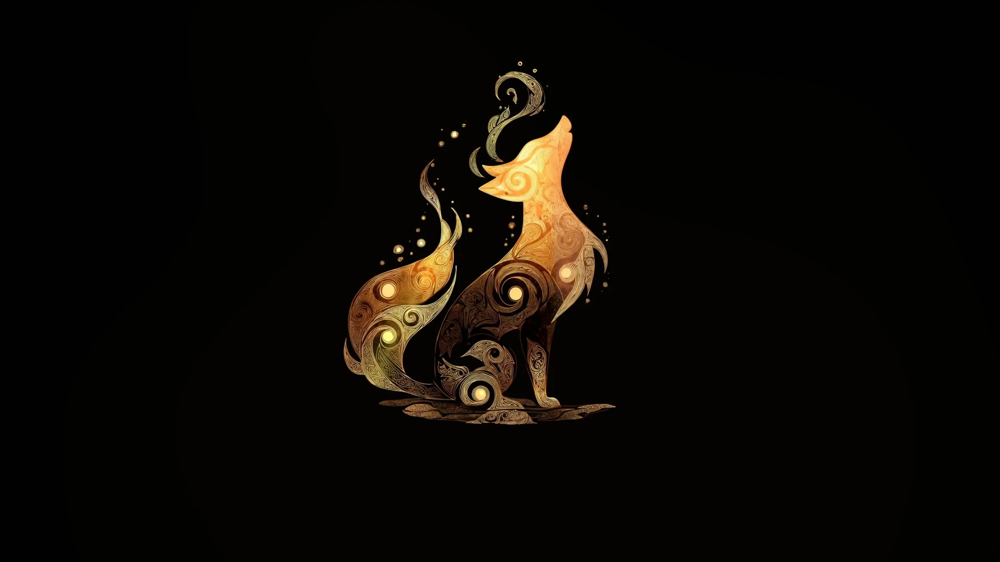

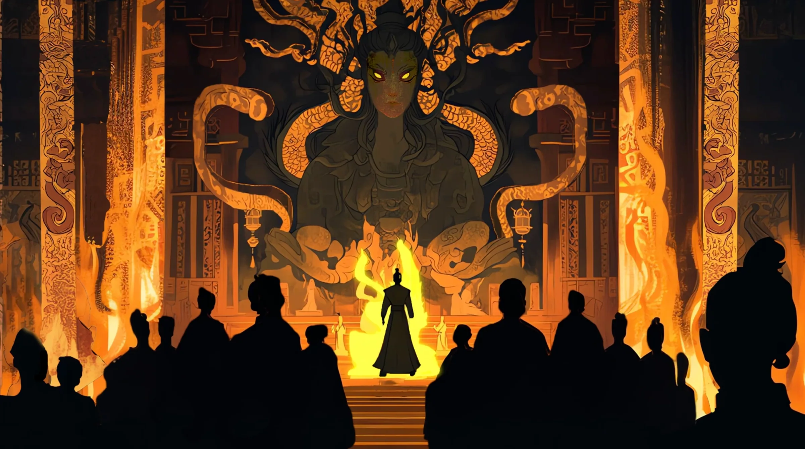

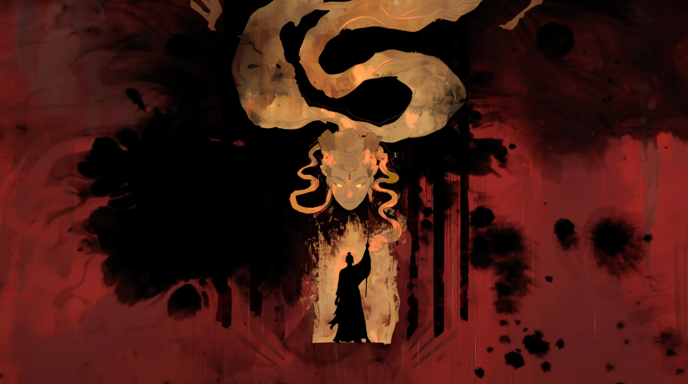

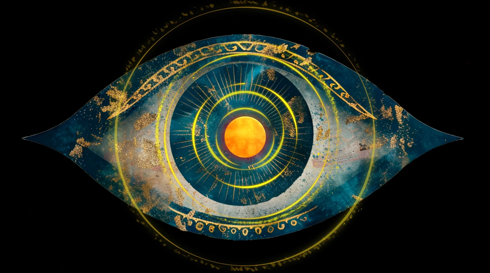

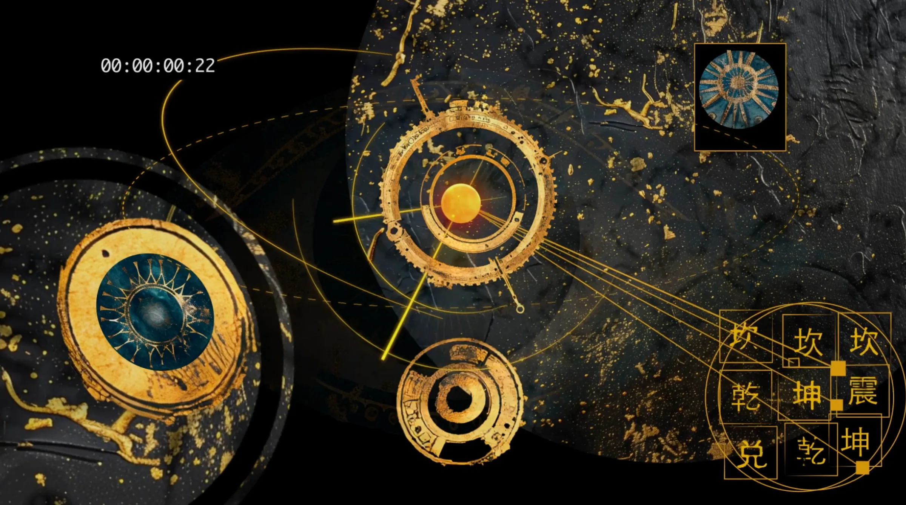

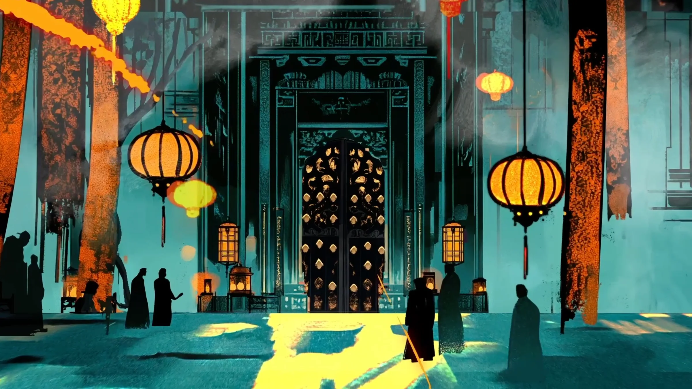

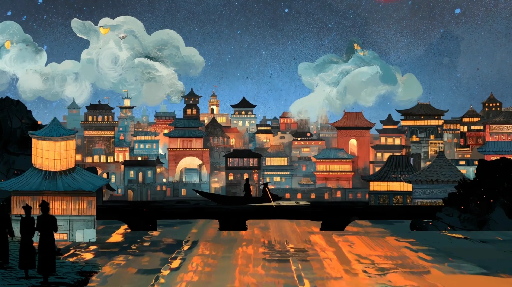

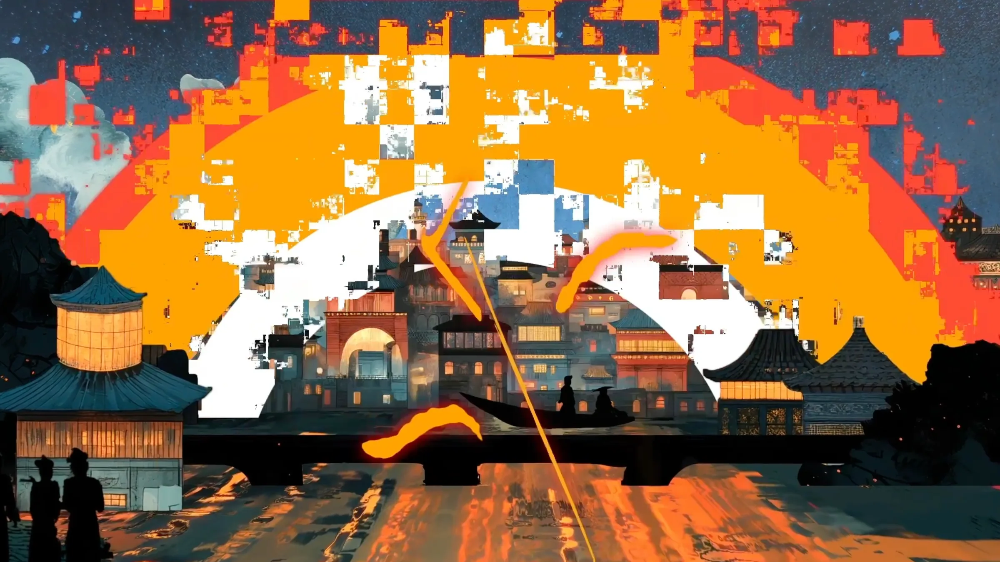

<!-- /auto:images -->

## E — THE FILM

