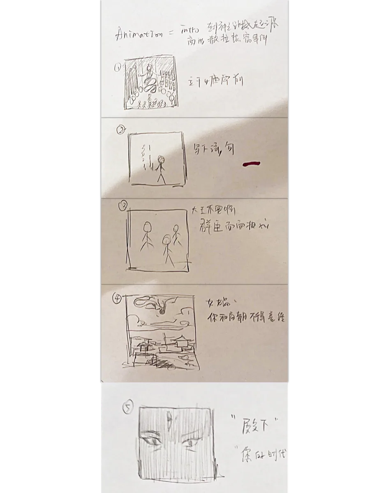

## A — INSPIRATION

*Berserk* set this off — resisting a fate already decided. That led to *The War of
Deification*: the fallen are enrolled as gods, from a list written before the war began.

It opens with a proud king insulting the goddess of creation. His kingdom falls.

<!-- auto:images -->

<!-- /auto:images -->

## B — EARLY CONCEPT AND STORY DEVELOPMENT

Storyboards for the rhythm, a script for the tone. No visual style yet, no technical
direction — just looking for a way to tell it.

A dynasty falls because of two lines the king writes on the goddess's wall:

> Within the golden chambers shines a beauty rare, 
> If she were mine, what joy beyond compare.

<!-- auto:skip 手排版面，导入脚本不要动这里 -->

<!-- 等高一行：分镜条 + 两段剧本录屏。--r 由脚本按实际显示尺寸写。
     那两段视频一直躺在 public/media 里没人引用 —— B 节本来只剩
     一条孤零零的分镜。 -->

<video src="/media/nine-lives-intro/b-early-concept-and-story-development-01.mp4" width="1356" height="1312" controls preload="metadata" aria-label="B — EARLY CONCEPT AND STORY DEVELOPMENT 02"></video>

<video src="/media/nine-lives-intro/b-early-concept-and-story-development-02.mp4" width="1356" height="1312" controls preload="metadata" aria-label="B — EARLY CONCEPT AND STORY DEVELOPMENT 03"></video>

## C — AI PROTOTYPE ITERATION

A test video in Sora AI, to check whether the story logic and the camera language worked. I
was working around what AI video was bad at then — characters that drift, transitions that
make no sense, no emotional register. Rough, but it confirmed the structure held.

<!-- auto:images -->

<video src="/media/nine-lives-intro/c-ai-prototype-iteration-01.mp4" width="2560" height="1440" controls preload="metadata" aria-label="C — AI PROTOTYPE ITERATION 01"></video>

<!-- /auto:images -->

## D — VISUAL STYLE AND TECHNICAL REFINEMENT

*The Secret of Kells*, Dunhuang murals and *Madoka Magica* pushed it to 2D flat animation
with collage composition — surreal, symbolic, fragmented, which gives the myth somewhere to
sit inside a flat space.

Script and scene design were revised to match. Base visuals generated in Midjourney, then
repainted and reconstructed in Photoshop and Procreate, animated in After Effects. Some shots
— the flames turning into a fox — are hand-drawn frame by frame.

<!-- auto:skip 手排版面，导入脚本不要动这里 -->

<!-- 三张比例是 2.00 / 1.33 / 1.33，多栏排会高低不齐 -->

## E — FILM STILLS

The opening holds still — stable composition, symbolic figures. After the king's poem it
goes abstract: Nüwa's anger as flat geometry, cosmic order coming apart. The last thirty
seconds turn realistic, with pseudo-3D depth built in After Effects.

The final explosion takes the shape of a fox.

<!-- auto:images -->

<!-- /auto:images -->

## F — THE FILM

