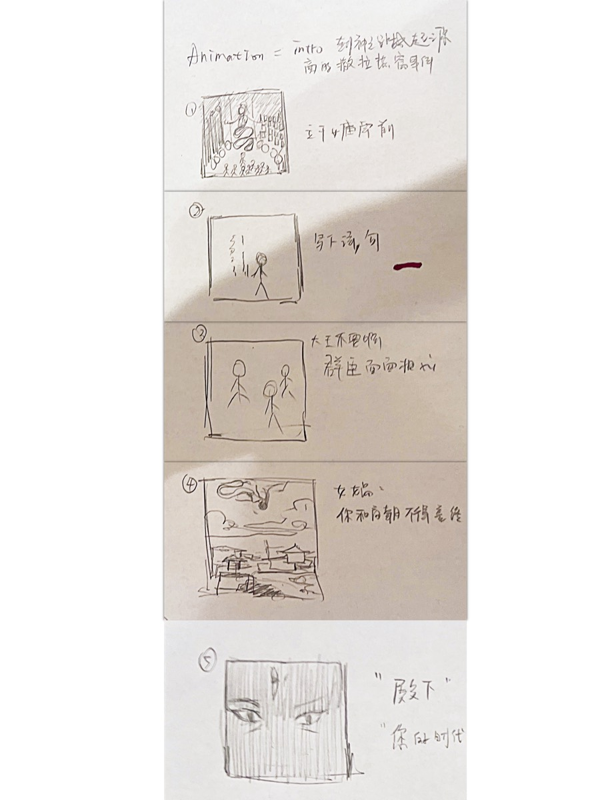

## A — INSPIRATION

*Berserk* set this off — the way people resist a fate that has already been decided. I took
that to *The War of Deification*, a Taoist myth where the fallen are enrolled as gods at the
end of the Shang dynasty. The irony is that the list was written before the war began.

I never finished the novel. I watched the animation as a child and kept only the feeling of
that world. This is its opening: a proud king insults the goddess of creation, and his
kingdom falls.

<!-- auto:images -->

<!-- /auto:images -->

## B — EARLY CONCEPT AND STORY DEVELOPMENT

A few storyboard sketches to find the rhythm, and a rough script to fix the tone. I was lost
at this point — no visual style, no technical direction, following impulse and trying to
find a way to tell it.

<!-- auto:images -->

<video src="/media/nine-lives-intro/b-early-concept-and-story-development-01.mp4" width="1356" height="1312" muted loop playsinline preload="metadata" data-autoplay aria-label="B — EARLY CONCEPT AND STORY DEVELOPMENT 01"></video>

<video src="/media/nine-lives-intro/b-early-concept-and-story-development-02.mp4" width="1356" height="1312" muted loop playsinline preload="metadata" data-autoplay aria-label="B — EARLY CONCEPT AND STORY DEVELOPMENT 02"></video>

<!-- /auto:images -->

## C — AI PROTOTYPE ITERATION

A test video in Sora AI, to check whether the story logic and the camera language worked. I
was working around what AI video was bad at then — characters that drift, transitions that
make no sense, no emotional register. Rough, but it confirmed the structure held.

<!-- auto:images -->

<video src="/media/nine-lives-intro/c-ai-prototype-iteration-01.mp4" width="2560" height="1440" controls preload="metadata" aria-label="C — AI PROTOTYPE ITERATION 01"></video>

<!-- /auto:images -->

## D — VISUAL STYLE AND TECHNICAL REFINEMENT

*The Secret of Kells*, Dunhuang murals and *Madoka Magica* pushed it to 2D flat animation
with collage composition — surreal, symbolic, fragmented, which gives the myth somewhere to
sit inside a flat space.

Script and scene design were revised to match. Base visuals generated in Midjourney, then
repainted and reconstructed in Photoshop and Procreate, animated in After Effects. Some shots
— the flames turning into a fox — are hand-drawn frame by frame.

<!-- auto:images -->

<!-- /auto:images -->

## E — FILM STILLS

Every visual decision has to serve the story.

The opening holds still: stable composition, symbolic figures, the setting established. From
the king's blasphemous poem the animation goes abstract — Nüwa's silent anger as flat
geometry, cosmic order coming apart.

The last thirty seconds return to something realistic, moving from the palace interior out to
the city. A pseudo-3D depth built in After Effects gives the flat animation space and
tension. The final explosion takes the shape of a fox — the protagonist of the game.

<!-- auto:images -->

<!-- /auto:images -->

## F — FINAL PRODUCTION AND REFLECTION

Three months, one minute twenty. This moved me from a graphic-design head to an animation
director's — storytelling, timing and visual rhythm as things you organise rather than feel
your way through.

What went wrong: project management, rough transitions, thin sound design. What I got: how to
hold visual consistency, technical execution and narrative rhythm at once, and where the
control sits between inspiration and production.
