## A — INSPIRATION

The inspiration for this work comes from *Berserk*, especially the tragic yet divine
resistance of human beings when facing inevitable fate, as well as my lifelong fascination
and admiration for mythological stories. I have always believed that people should not only
live in the world before their eyes, but also have imagination that reaches farther.

Therefore, I chose *The War of Deification*, a classical Chinese myth based on the Taoist
worldview. The story takes place at the end of the Shang Dynasty, when the three realms
were in turmoil and a great war that would reshape the world was about to begin. All fallen
heroes would have their names written on the "List of Gods," becoming divine beings in the
new order. The irony is that the list had already been written — everything unfolds
according to the path of fate.

To be honest, the original novel is long and difficult to read, and I have never finished
it. I only watched the animation and read fragments of it when I was a child. However, I
have always remembered the feeling of that vast world where gods and humans coexist. So I
decided to create this animation to depict the very beginning of it all — a proud king who
offended the goddess of creation, leading to the destruction of his kingdom.

<!-- auto:images -->

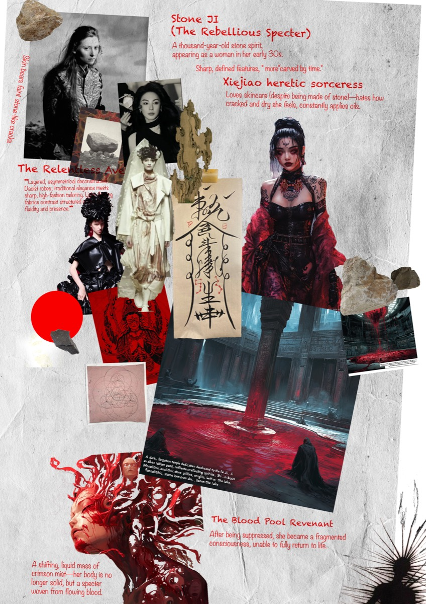

<!-- /auto:images -->

## B — EARLY CONCEPT AND STORY DEVELOPMENT

I made a few simple storyboard sketches to explore the rhythm and flow of the scenes in the
most direct way. At the same time, I started writing a rough version of the script to define
the overall tone of the animation. However, I was still quite lost then. I hadn't decided on
a visual style or figured out the technical direction. I was simply following my impulse and
intuition, trying to find a way to tell this story.

<!-- auto:images -->

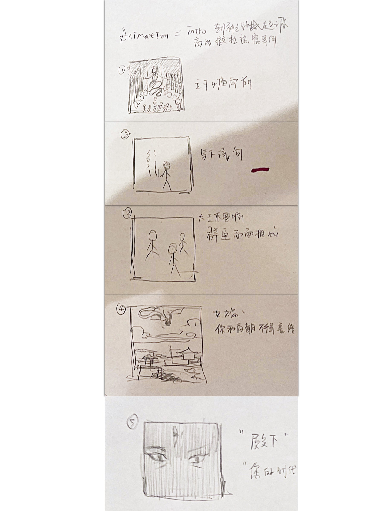

<video src="/media/nine-lives-intro/b-early-concept-and-story-development-01.mp4" controls playsinline preload="metadata" aria-label="B — EARLY CONCEPT AND STORY DEVELOPMENT — video 01"></video>

<video src="/media/nine-lives-intro/b-early-concept-and-story-development-02.mp4" controls playsinline preload="metadata" aria-label="B — EARLY CONCEPT AND STORY DEVELOPMENT — video 02"></video>

<!-- /auto:images -->

## C — AI PROTOTYPE ITERATION

I used Sora AI to create a simple test video to check whether my story logic and camera
language worked. During the process, I tried to avoid common problems in AI video generation
at that time, such as inconsistent characters, strange camera transitions, and lack of
emotional expression. Although the test video was still rough, it helped me quickly confirm
that the story structure was reasonable and gave me confidence in the creative direction
ahead.

<!-- auto:images -->

<video src="/media/nine-lives-intro/c-ai-prototype-iteration-01.mp4" controls playsinline preload="metadata" aria-label="C — AI PROTOTYPE ITERATION — video 01"></video>

<!-- /auto:images -->

## D — VISUAL STYLE AND TECHNICAL REFINEMENT

At this stage, I began to explore how to make the story more distinctive in visual style
and tone. Inspired by *The Secret of Kells*, Dunhuang murals, and *Puella Magi Madoka
Magica*, I decided to complete this work in the form of 2D flat animation. I adopted a
collage-style composition, which creates a sense of surrealism, symbolism, and fragmented
storytelling, giving the mythological theme a new dimension within a flat visual space.

To align the visuals with the story, my first step was to revise the script and scene design
based on the evolving art style. After redrawing parts of the storyboard, I used Midjourney
to generate base visuals, then refined and reconstructed them in Photoshop and Procreate
through layered editing and repainting. Finally, I completed the animation and effects in
After Effects. Some shots, such as the scene where the flames transform into a fox, were
hand-drawn frame by frame, to enhance the handmade texture and emotional continuity of the
animation.

<!-- auto:images -->

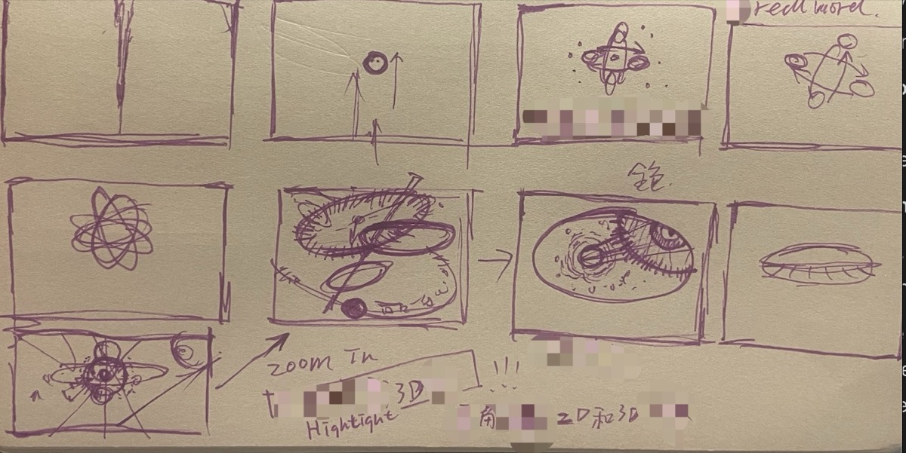

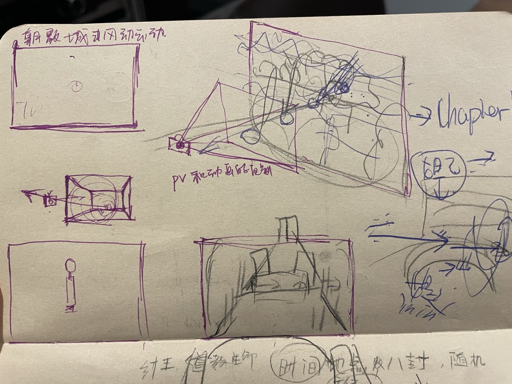

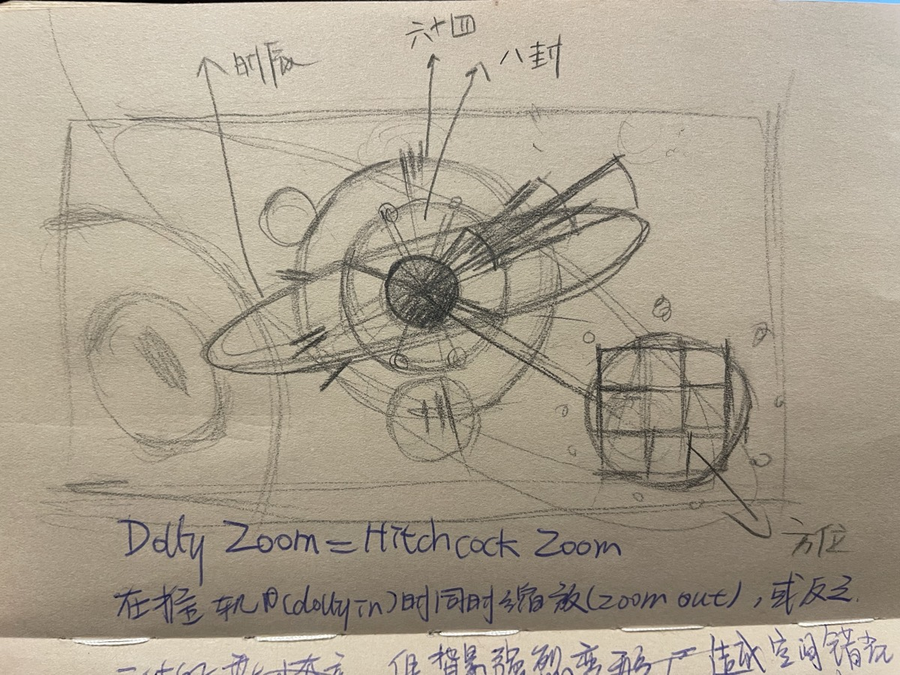

<!-- /auto:images -->

## E — FILM STILLS

Throughout the entire animation, I placed great importance on narrative coherence and
stylistic consistency. I believe every visual decision must serve the storytelling.

In detail, the opening sequence uses stable composition and symbolic figures to establish
the background and setting. From the scene where the king writes the blasphemous poem, the
animation shifts into an abstract state — Nüwa's "silent anger" is expressed through flat
geometric composition, symbolizing the collapse of cosmic order in Taoist philosophy.

In the final thirty seconds, the narrative returns to a more realistic atmosphere. The
scenes transition from the interior of the palace to the city's exterior and finally to a
wide urban view. In After Effects, I created a pseudo-3D depth to give the flat animation a
sense of space, motion, and divine tension. The final explosion transforms into the shape of
a fox — the future protagonist of the game.

This alternation between abstraction and realism builds rhythm and balance throughout the
work. To maintain unity across these visual changes, I ensured that the textures, shapes,
and even the line quality remained internally and externally connected, preserving both
visual harmony and emotional flow.

<!-- auto:images -->

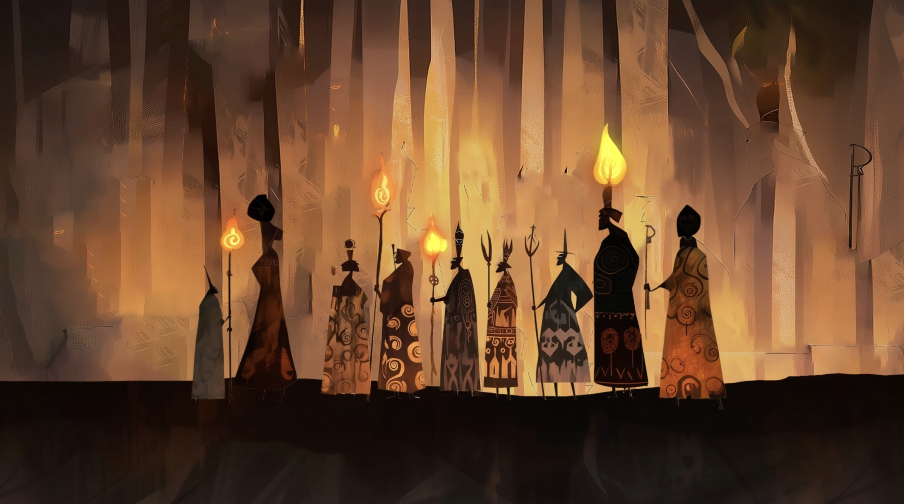

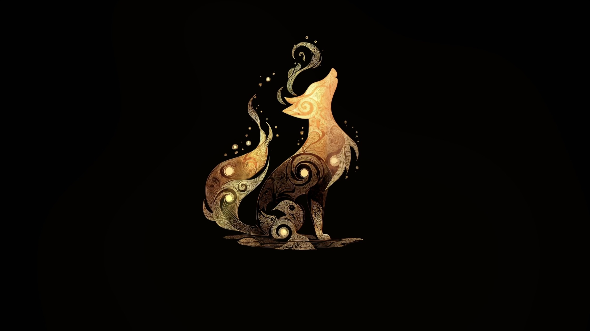

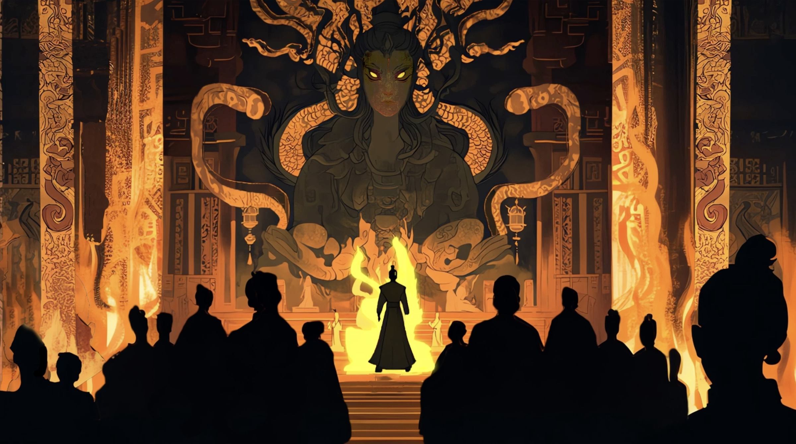

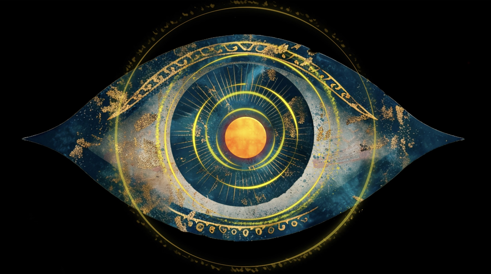

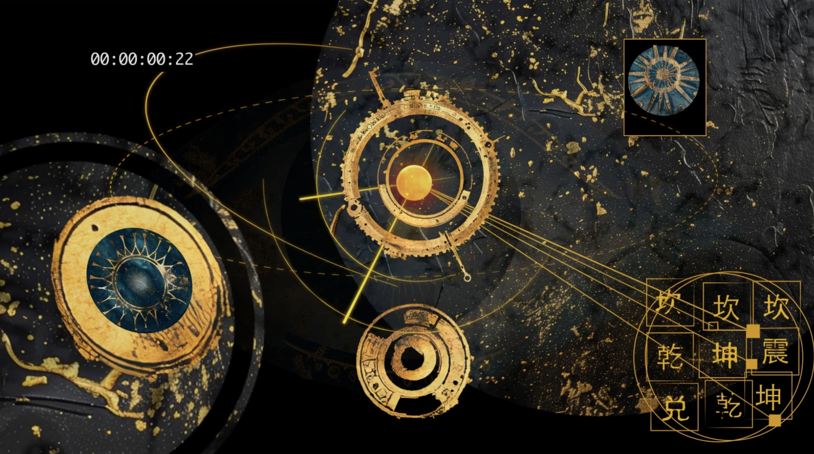

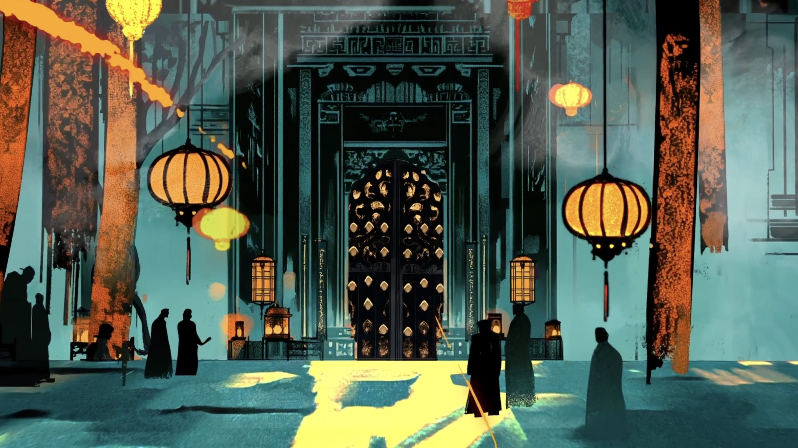

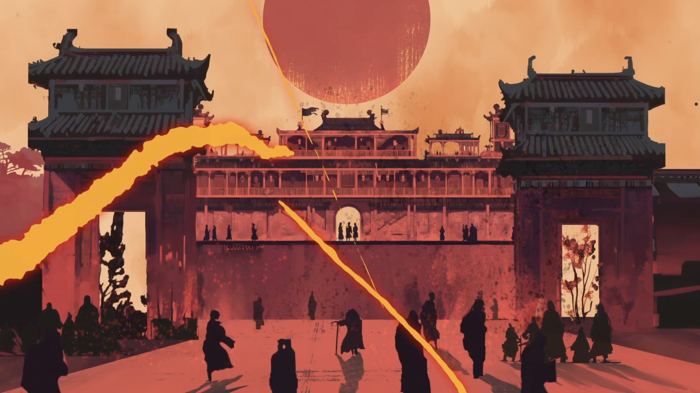

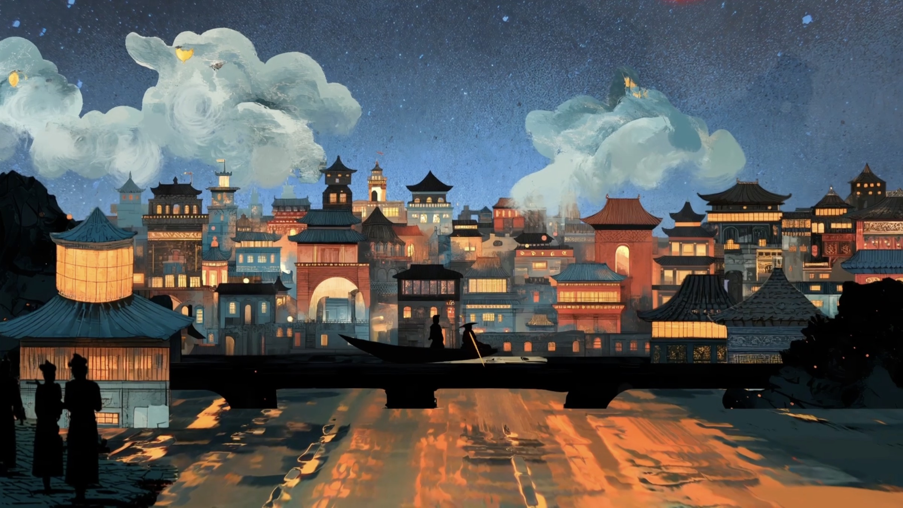

<!-- /auto:images -->

## F — FINAL PRODUCTION AND REFLECTION

Over three months, I completed a 1-minute-20-second animation. This project helped me move
from a graphic design mindset to thinking like an animation director. I learned how to
organize storytelling, timing, and visual rhythm in a structured way. During production, I
constantly adjusted the pacing and camera transitions, testing how visuals and sound worked
together to make the flow more natural and consistent.

There were still some issues, such as imperfect project management, rough scene transitions,
and limited depth in the sound design. However, through this process, I learned how to
balance visual consistency, technical execution, and narrative rhythm — and how to find real
control between inspiration and production.
