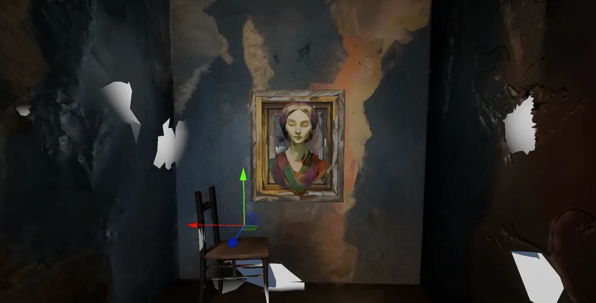
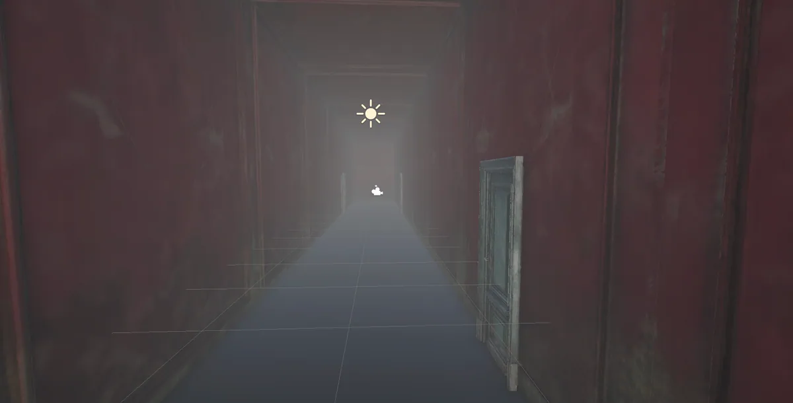
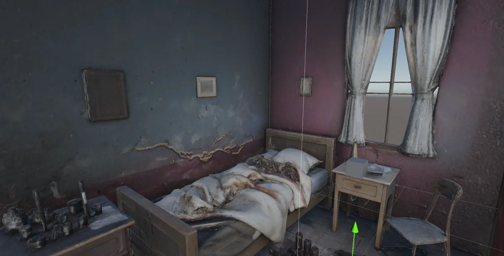
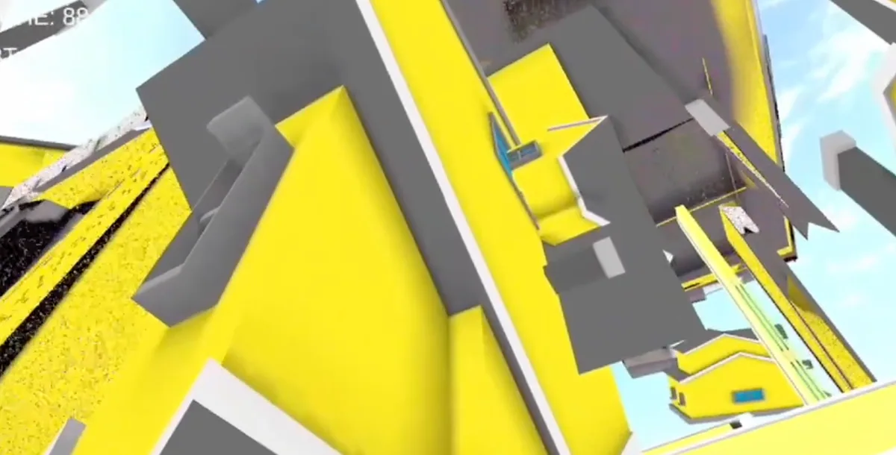

## A — PROJECT OVERVIEW

A first-person narrative installation on memory, debt and entropy. Built in Unity with URP:
an infinite corridor of memory chambers where the path and the ending are driven by a
mathematical model of the protagonist's psychological state.

<!-- auto:images -->
<div class="rows-2">









</div>
<!-- /auto:images -->

## B — GAMEPLAY FLOW

A prologue leads into the corridor. Six memory chambers across two phases, fragments
collected toward a final judgment, ending in one of three states: **Stable**, **Unstable**,
**Collapse**.

<div class="dg dg-flow">

<div class="dg-node"><b>Bootstrap</b></div>
<div class="dg-arrow"></div>
<div class="dg-node"><b>Main menu</b></div>
<div class="dg-arrow"></div>
<div class="dg-node"><b>Wakeup room</b></div>

<div class="dg-arrow"></div>

<div class="dg-row">
<div class="dg-node">Branching dialogue<br/>+ voiceover</div>
<span class="dg-sep">→</span>
<div class="dg-node">Timeline<br/>cinematic</div>
<span class="dg-sep">→</span>
<div class="dg-node">Read the<br/>letter</div>
<span class="dg-sep">→</span>
<div class="dg-node">Gameplay<br/>enabled</div>
</div>

<div class="dg-arrow long"></div>

<div class="dg-node key"><b>Infinite corridor</b><i>AI-generated paintings · infinite loop</i></div>

<div class="dg-arrow long"></div>

<div class="dg-split">
<div class="dg-branch">
<span class="dg-label">Phase A</span>
<div class="dg-node">Room 1 — Melting community<i>400 procedural houses</i></div>
<div class="dg-node">Room 2</div>
<div class="dg-node">Room 3</div>
<span class="dg-label">Collect 3 memories</span>
</div>
<div class="dg-branch">
<span class="dg-label">Phase B</span>
<div class="dg-node">Room 4</div>
<div class="dg-node">Room 5</div>
<div class="dg-node">Room 6</div>
<span class="dg-label">Collect 3 memories</span>
</div>
</div>

<div class="dg-arrow long"></div>

<div class="dg-node"><b>Archive room</b><i>Space-bar sequences · entropy 3D model</i></div>

<div class="dg-arrow"></div>

<div class="dg-node key"><b>Chapter evaluation</b>
<span class="dg-eq">S =
<span class="dg-frac"><span>Psyche</span><span>√(Debt × Entropy + 1)</span></span>
</span>
</div>

<div class="dg-arrow long"></div>

<div class="dg-ends">
<div class="dg-node"><b>Stable</b><i>S &gt; 1.5</i></div>
<div class="dg-node"><b>Unstable</b><i>S &gt; 0.8</i></div>
<div class="dg-node"><b>Collapse</b><i>otherwise</i></div>
</div>

</div>

## C — TECHNICAL BREAKDOWN

Layered and event-driven. All game data lives in ScriptableObject assets — no hardcoding.
Systems talk through a static event bus, so no script references another directly, and every
component stays independently testable and swappable.

<div class="dg">

<div class="dg-layer">
<span class="dg-label">Data<span>Layer 1</span></span>
<div class="dg-boxes">
<div class="dg-node"><b>GameBalanceConfig</b><i>all tunable params</i></div>
<div class="dg-node"><b>NarrationDatabase</b><i>dialogue &amp; conditions</i></div>
<div class="dg-node"><b>WakeupDialogueData</b><i>branching dialogue</i></div>
<div class="dg-node"><b>EndingData</b><i>3 endings</i></div>
<p class="dg-note">ScriptableObject assets — no hardcoding</p>
</div>
</div>

<div class="dg-layer">
<span class="dg-label">Singleton managers<span>Layer 2</span></span>
<div class="dg-boxes">
<div class="dg-node"><b>GlobalProgressManager</b><i>scene flow, memory tracking</i></div>
<div class="dg-node"><b>GlobalMentalState</b><i>entropy simulation</i></div>
<div class="dg-node"><b>GlobalUIManager</b><i>pause, cursor, UI</i></div>
<div class="dg-node"><b>NarratorManager</b><i>queue-based playback</i></div>
<div class="dg-node"><b>ScreenFader</b><i>transitions</i></div>
<p class="dg-note">DontDestroyOnLoad — persistent across scenes</p>
</div>
</div>

<div class="dg-layer">
<span class="dg-label">Event bus<span>Layer 3</span></span>
<div class="dg-boxes">
<div class="dg-node key"><b>NarrationAnnouncer</b><i>static event bus — zero dependencies</i></div>
<div class="dg-node">in — OnNarrationRequested<br/>in — OnSceneEventTriggered</div>
<div class="dg-node">out — OnNarrationStarted<br/>out — OnNarrationEnded</div>
<p class="dg-note">No script directly references another</p>
</div>
</div>

<div class="dg-layer">
<span class="dg-label">Scene systems<span>Layer 4</span></span>
<div class="dg-boxes">
<div class="dg-node"><b>Wakeup</b><i>WakeupSequenceManager · DialogueUI · Letter</i></div>
<div class="dg-node"><b>Corridor</b><i>UniversalPlayer · CorridorManager · DoorManager · AITextureRequester · MemoryItem</i></div>
<div class="dg-node"><b>Memory rooms</b><i>Room1SequenceManager · MeltController · InfiniteCommunity</i></div>
<div class="dg-node"><b>Archive</b><i>ArchiveSpaceSequence · ChapterEvaluator</i></div>
</div>
</div>

<div class="dg-layer">
<span class="dg-label">Causal entropy MVC<span>Layer 5</span></span>
<div class="dg-row">
<div class="dg-node"><b>CausalModel</b><i>pure C# logic</i></div>
<span class="dg-sep">→</span>
<div class="dg-node"><b>CausalController</b><i>MonoBehaviour bridge</i></div>
<span class="dg-sep">→</span>
<div class="dg-node"><b>CausalView</b><i>shader driver</i></div>
<span class="dg-sep">→</span>
<div class="dg-node"><b>Custom shaders</b><i>MeltDistortion · CausalEntropy</i></div>
</div>
</div>

</div>

## D — 400 HOUSES, ONE FLOAT

Room 1 melts a suburb. Twenty by twenty, four hundred houses, each sagging and dripping on
its own schedule so the street doesn't collapse in military formation.

The obvious way to build that is a script on every house: read a timer, offset it by a
random number, push the value into the material. It works, and it costs four hundred
`Update()` calls and four hundred material instances — anything that writes to
`material.SetFloat` gets its own copy of the material, and nothing batches.

So the timing moved out of C# and into the vertex shader. One director script pushes a
single global float:

```csharp
Shader.SetGlobalFloat(GlobalMeltProgressID, progress);   // 0 → 1 over 8 seconds
```

Every house reads that same float, then works out its own delay by hashing where it stands:

```hlsl
float3 objCenter = TransformObjectToWorld(float3(0, 0, 0));
float randomVal  = frac(sin(dot(objCenter.xyz, float3(12.9898, 78.233, 45.164))) * 43758.5453);
float delay      = randomVal * 0.5;                   // up to 50% late
float localProgress = saturate((_GlobalMeltProgress - delay) / (1.0 - delay));
```

The hash is deterministic, so a house at a given coordinate always melts at the same
moment. The randomness is stable across runs and costs nothing to store.

<div class="dg dg-tbl">

<div class="dg-th">&nbsp;</div>
<div class="dg-th">Script per house</div>
<div class="dg-th">One global float</div>

<div><b>Scripts on houses</b></div>
<div>400</div>
<div>0</div>

<div><b>Material instances</b></div>
<div>400</div>
<div>1</div>

<div><b>Update() calls per frame</b></div>
<div>400</div>
<div>1</div>

</div>

Deformation is four octaves of value noise driving outward bulge, downward drip and sway.
Dissolve is the same noise thresholded against progress, with an edge glow that burns off
at the boundary. The grid itself stays tunable — `rows`, `cols` and spacing are fields, so
the street can be re-scaled without touching the shader.

The melt is also scrubbable in the Editor. `MeltController` runs under `[ExecuteAlways]`
with a `debugProgress` slider, so the whole street can be posed at 40% melted without
entering Play mode. That is how the timing curve actually got tuned.

Four hundred separate renderers are still four hundred renderers, so the room ships with a
small editor tool — `Tools → Combine Selected Meshes into One`. Select the `Houses` root
and it groups every child by material, welds each group into one mesh, writes it out as a
`.asset` and rebuilds the hierarchy as static geometry.

Three decisions in it are worth naming, because they are the difference between a script
that works once and a tool someone else can use:

<div class="dg dg-tbl">

<div class="dg-th">Decision</div>
<div class="dg-th">Reason</div>
<div class="dg-th">&nbsp;</div>

<div><code>IndexFormat.UInt32</code></div>
<div>Four hundred houses blow straight past the 65,535-vertex ceiling on 16-bit indices.</div>
<div>Without it the merge silently truncates.</div>

<div><code>Undo.RegisterCreatedObjectUndo</code></div>
<div>An editor tool that can't be undone is one a person only dares run once.</div>
<div>Ctrl+Z works on it.</div>

<div><b>Originals are never deleted</b></div>
<div>The merge is destructive and irreversible in the asset sense.</div>
<div>It reports the counts and leaves the old hierarchy for you to delete once you've checked.</div>

</div>

<!-- TODO: add measured frame time / draw calls (Profiler + Frame Debugger) once captured -->

## E — SEE IT IN ACTION

Words and diagrams can only show so much. Watch the full walkthrough to see how it all
comes together.

<div class="tube" data-tube="ywdpvI_SuBE" data-tube-label="The Last Compact — full walkthrough"></div>
